Lab Environment
A website is accessible at http://target.ine.local. Perform reconnaissance and capture the following flags.

Flag 1: This tells search engines what to and what not to avoid.

Flag 2: What website is running on the target, and what is its version?

Flag 3: Directory browsing might reveal where files are stored.

Flag 4: An overlooked backup file in the webroot can be problematic if it reveals sensitive configuration details.

Flag 5: Certain files may reveal something interesting when mirrored.

Tools:

Firefox
Curl
HTTrack

## Lets start with an Nmap scan 

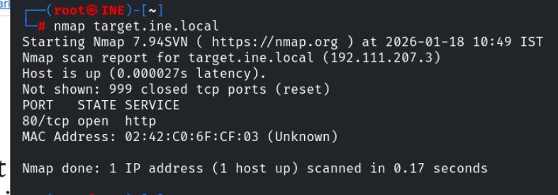

We found only one open port , lets perform service version detection and default script scan on it 

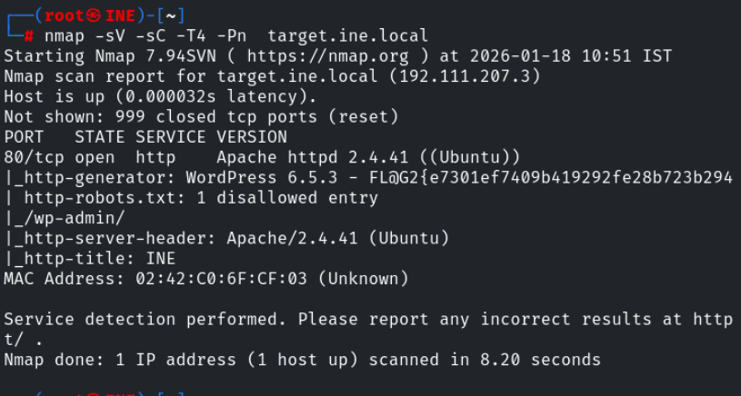

We successfully found the flag2 , now lets visit the site running on port 80 

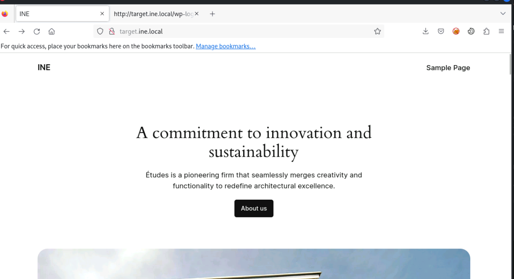

lets check the robots.txt file 

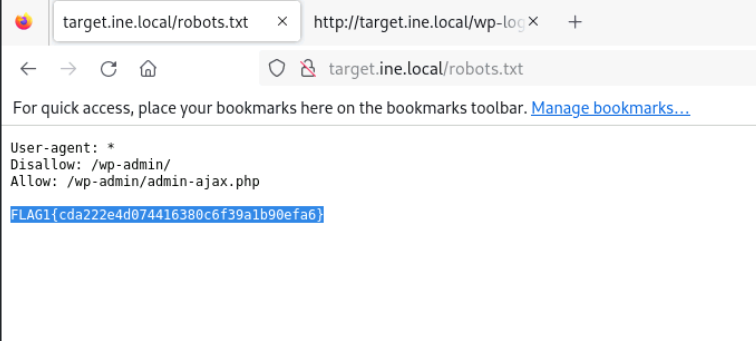

We successfully found the flag1

Lets use gobuster to enemurate the web directories

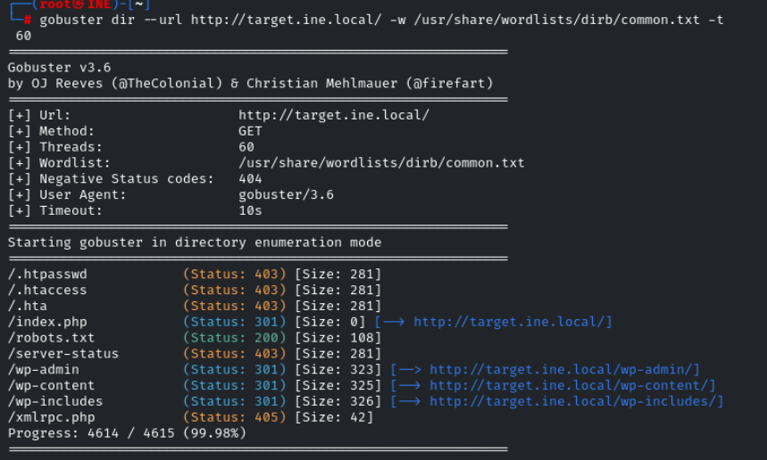

no juciy information is found in wp-admin or wp-includes so lets visit wp-content

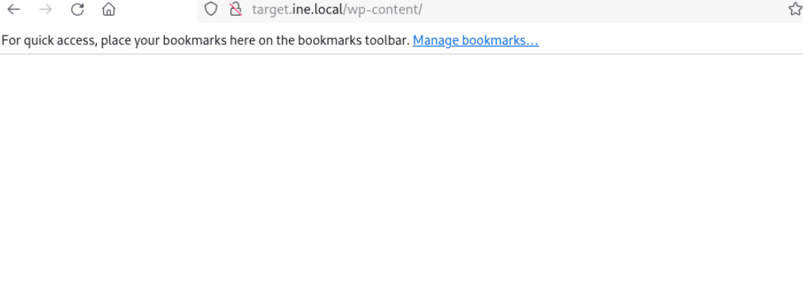

Lets enemurate directories under wp-content

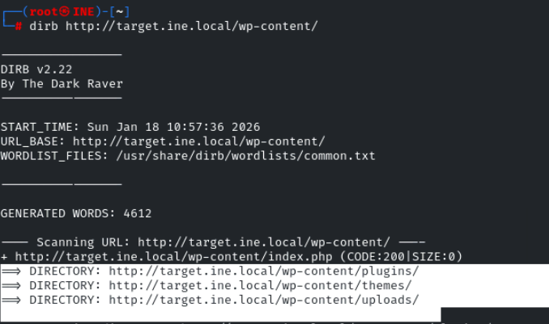

Lets naviagte to the path /uploads

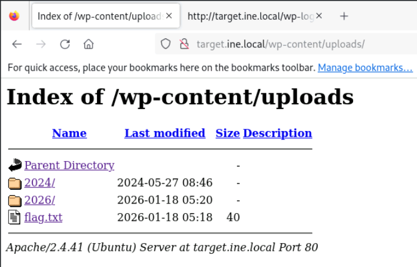

We successfully found the flag3

lets use httrack to clone the webiste 

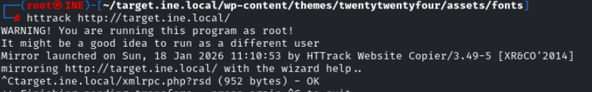

lets visit the files

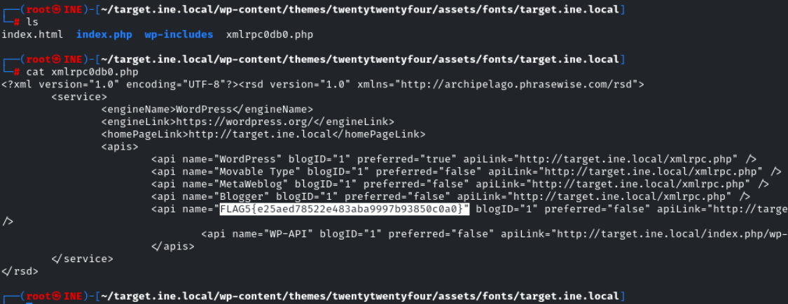

We successfully found the flag 5

seems like flag4 is hidden in a backup file , so lets search for backup files with gobuster

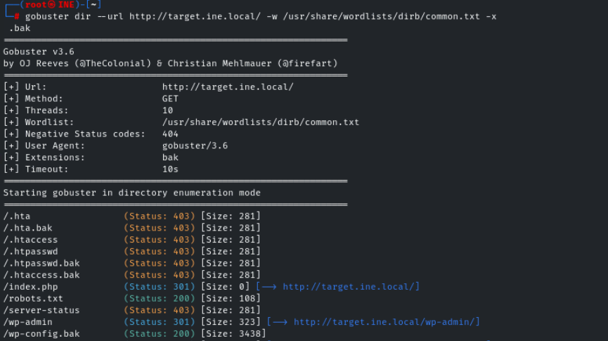

While accessing the path a file has been downlaoded , so lets visit the file 

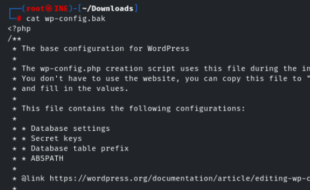

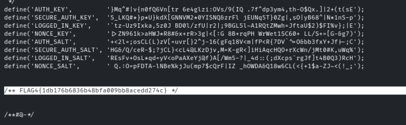

We successfully found the flag4

----------------------------------------------------------------THE END---------------------------------------------------------------------------

