Lab Environment
A Linux machine is accessible at target.ine.local. Identify the services running on the machine and capture the flags. The flag is an md5 hash format.

Flag 1: There is a samba share that allows anonymous access. Wonder what's in there!
Flag 2: One of the samba users have a bad password. Their private share with the same name as their username is at risk!
Flag 3: Follow the hint given in the previous flag to uncover this one.
Flag 4: This is a warning meant to deter unauthorized users from logging in.
Note: The wordlists located in the following directory will be useful:

/root/Desktop/wordlists
Tools
Nmap
Metasploit
Hydra
enum4linux
smbclient
smbmap

## lets start with an Namp scan

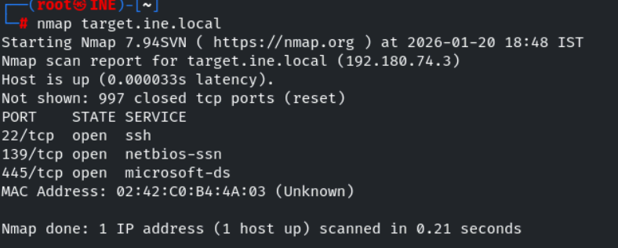

We found three open ports lets perform service version detection and default script scan on them

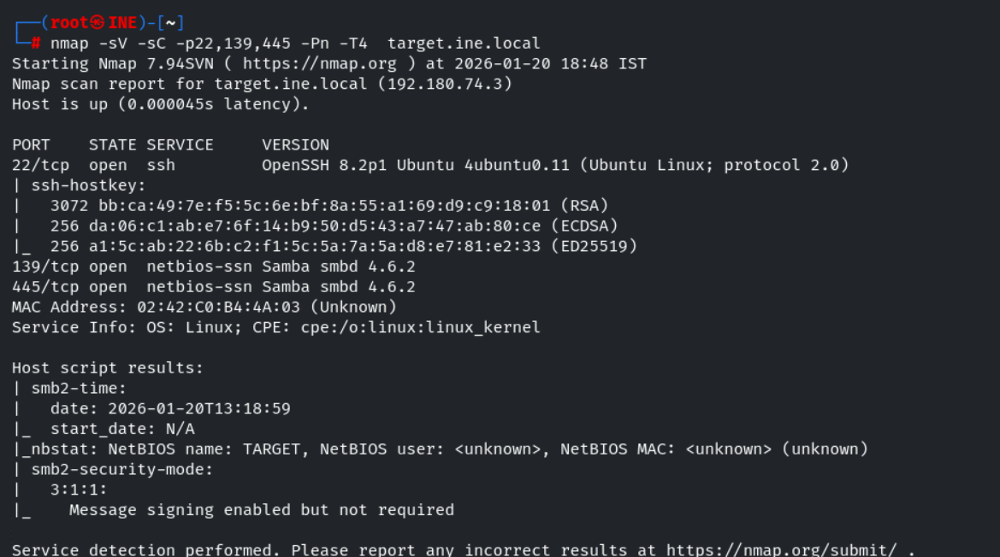

lets use enum4linux to enemurate more information about smb shares ,usernames etc ..

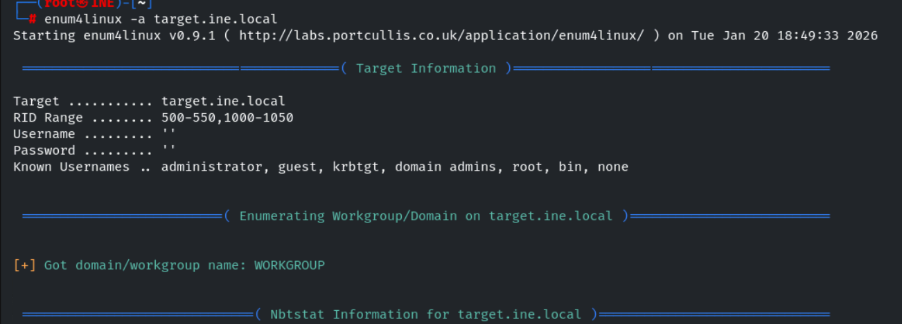

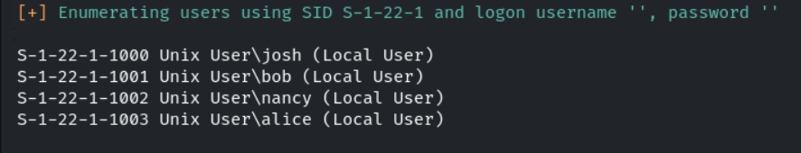

we found four usernames , lets add it to a file users.txt

Now lets brute force for shares

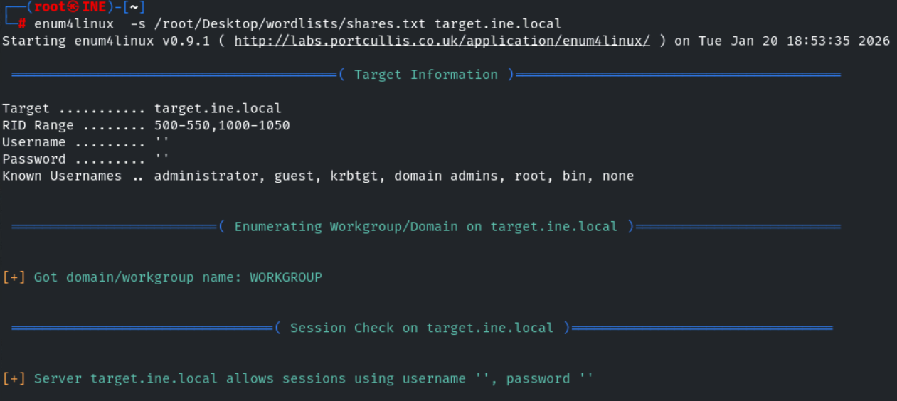

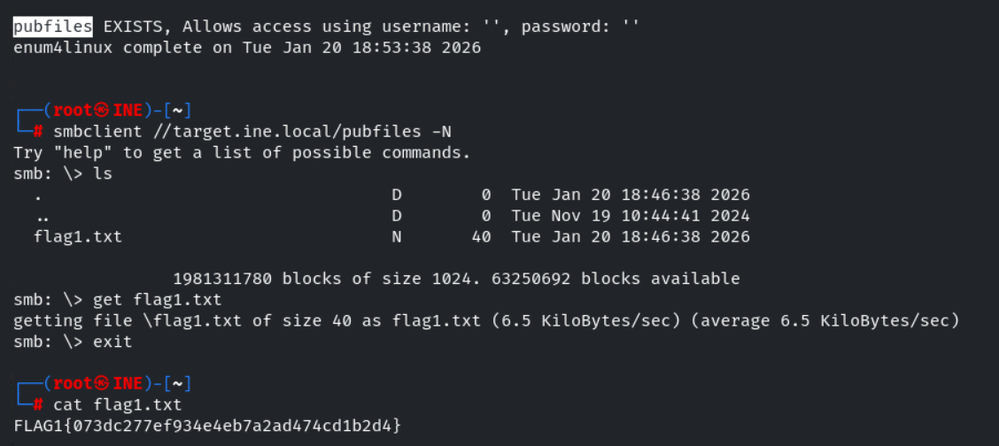

We successfully found the flag1 , lets enemurate for password for smb users we found

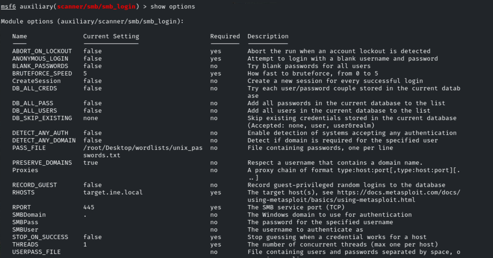

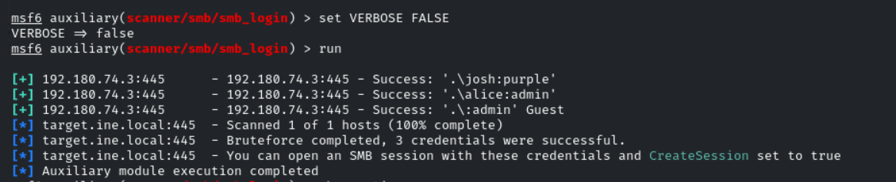

We successfully found the password , lets login 

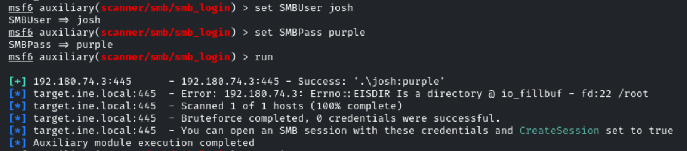

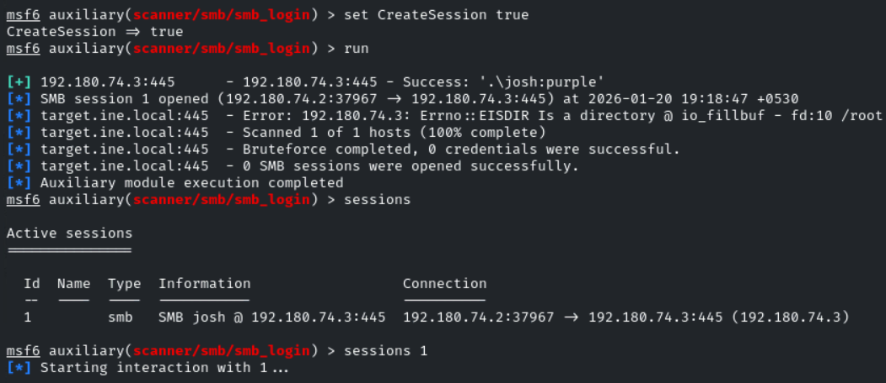

We successfully found the flag2 , now lets perform a full port scan 

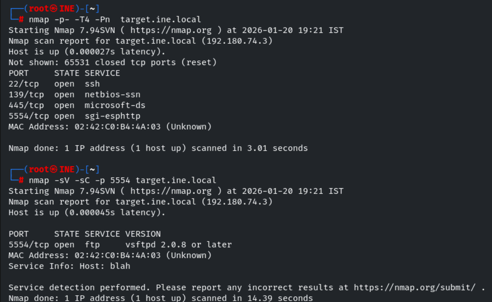

lets brute force for ftp with the users we found 

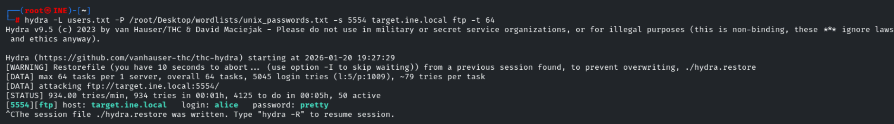

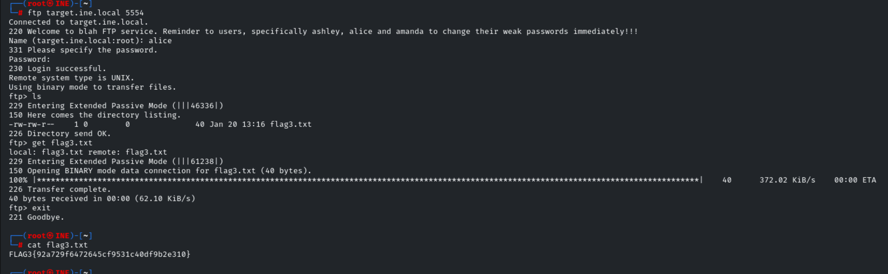

We successfully found the flag3

Flag 4: This is a warning meant to deter unauthorized users from logging in.

lets try login into ssh 

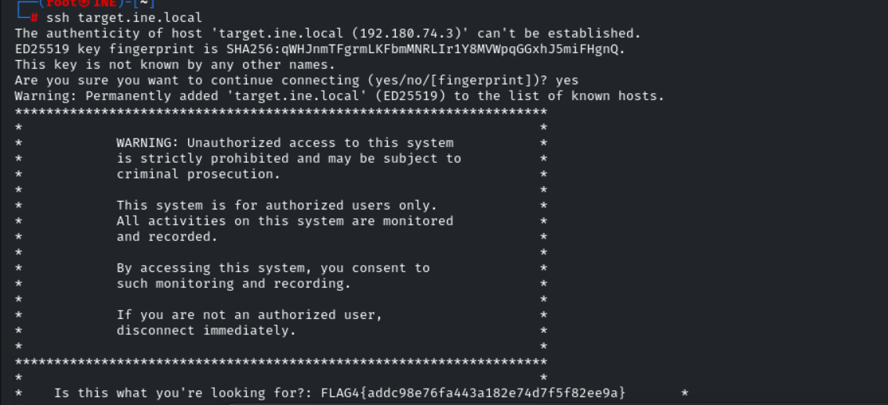

We successfully found the flag4

------------------------------------------------------------THE END---------------------------------------------------------------------------

