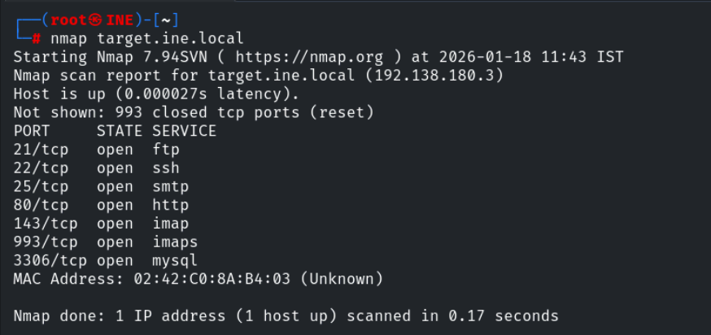
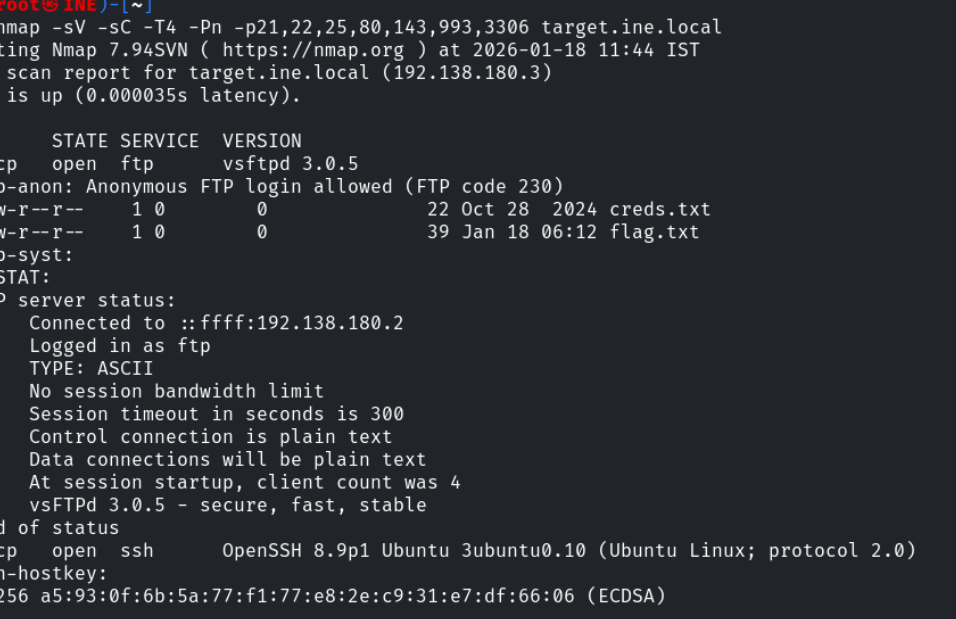
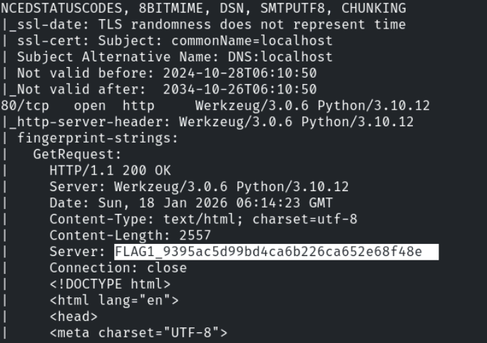
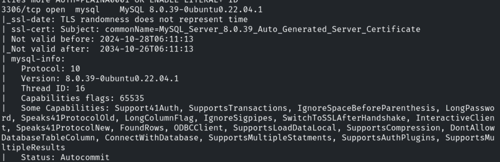
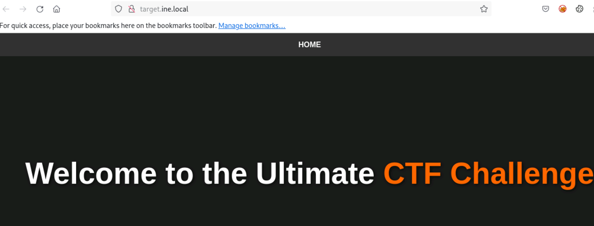
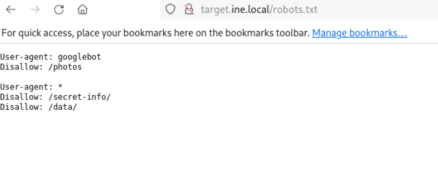
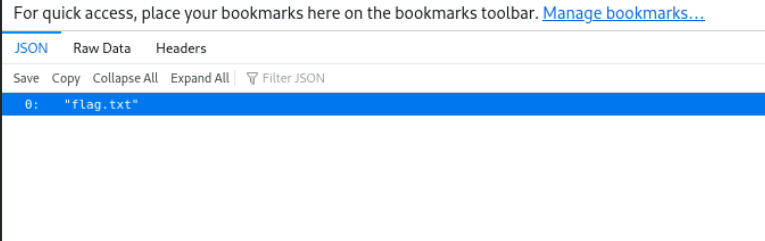
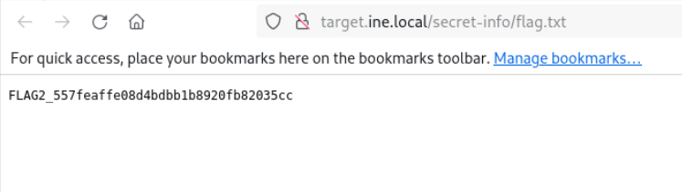
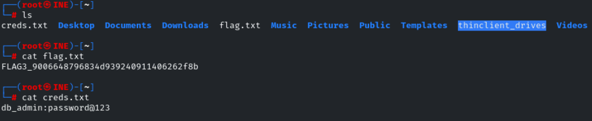
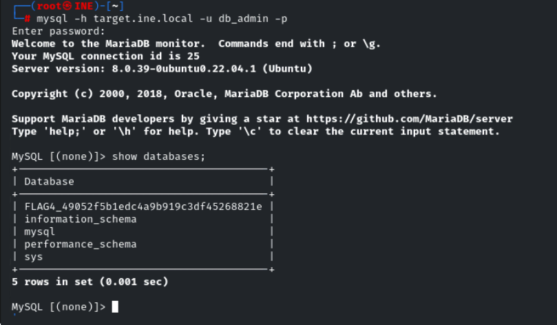

Lab Environment
In this lab environment, you will be provided with GUI access to a Kali Linux machine. The target machine will be accessible at http://target.ine.local.

Objective: Perform reconnaissance on the target and capture all the flags hidden within the environment.

Flags to Capture:

Flag 1: The server proudly announces its identity in every response. Look closely; you might find something unusual.

Flag 2: The gatekeeper's instructions often reveal what should remain unseen. Don't forget to read between the lines.

Flag 3: Anonymous access sometimes leads to forgotten treasures. Connect and explore the directory; you might stumble upon something valuable.

Flag 4: A well-named database can be quite revealing. Peek at the configurations to discover the hidden treasure.

Tools

The best tools for this lab are:

Nmap
FTP
MySQL

## Lets start with an Nmap scan 

Lets perform service version detection and default script scan on the open ports 

We successfully found the flag1 

Lets visit the site running on port 80 

Lets visit the robots.txt file 

lets navigate to /secret-info

lets access the flag.txt

We successfully found the flag2

we know that ftp allows Anonymous login from our nmap scan , so lets login into ftp with username and password as Anonymous

lets access that two files 

We successfully found the flag3

lets use that credits to login into mysql server

We successfully found the flag4

-----------------------------------------------------------------------------------------THE END-----------------------------------------------------------------------------

