Flags to Capture:

Flag 1: Explore hidden directories for version control artifacts that might reveal valuable information.

Flag 2: The data storage has some loose security measures. Can you find the flag hidden within it?

Flag 3: A PHP file that displays server information might be worth examining. What could be hidden in plain sight?

Flag 4: Sensitive directories might hold critical information. Search through carefully for hidden gems.

Tools
The best tools for this lab are:

Nmap,
Nessus

# Lets start with an nmap scan

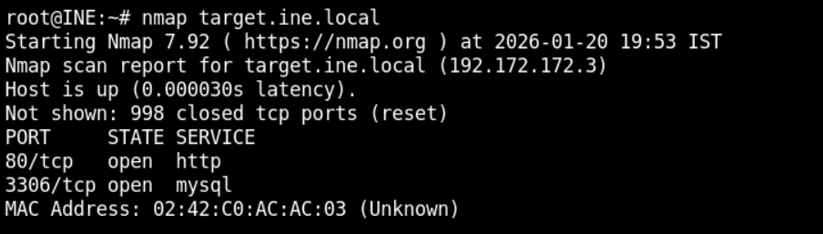

We found two open ports , lets perform service version detection and default script scan on them

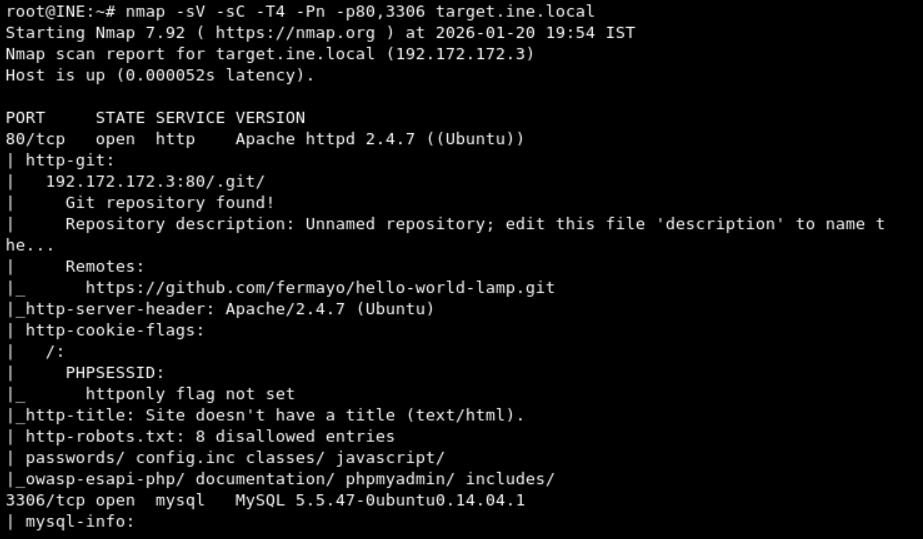

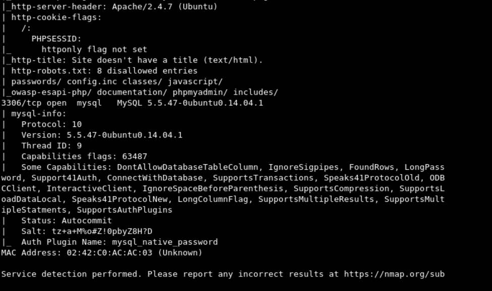

Lets visit the robots.txt

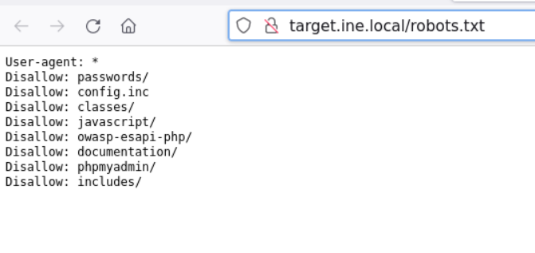

Lets visit the /passwords

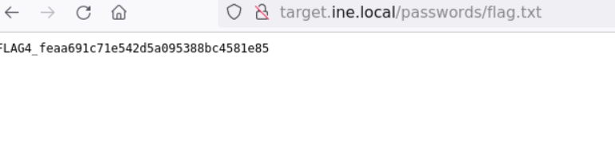

We suceessfully found the flag4 

in our nmap scan we found a git respository

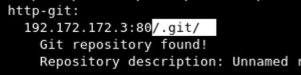

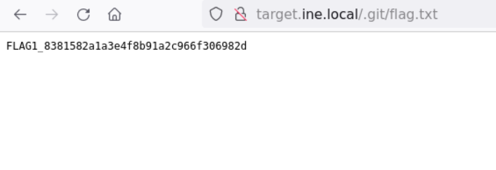

We Successfully found the flag1

now lets visit phpmyadmin path

after visiting all the options in mysql , secret_info found the flag2

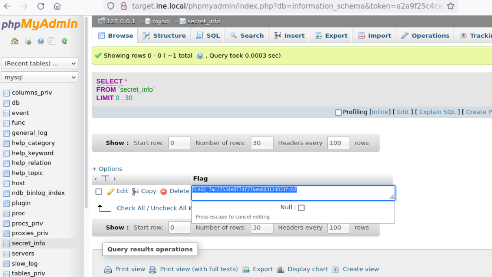

now lets use gobuster to web directories

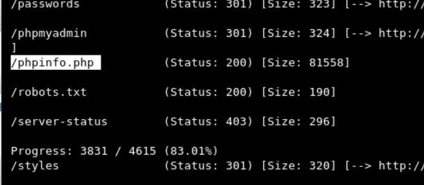

lets visit /phpinfo.php we can also we nmap script http-enum to find it 

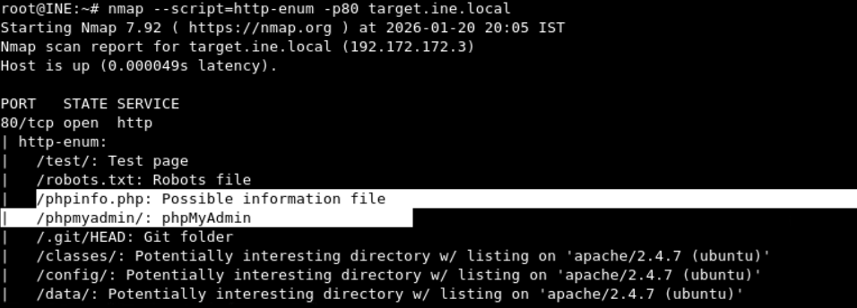

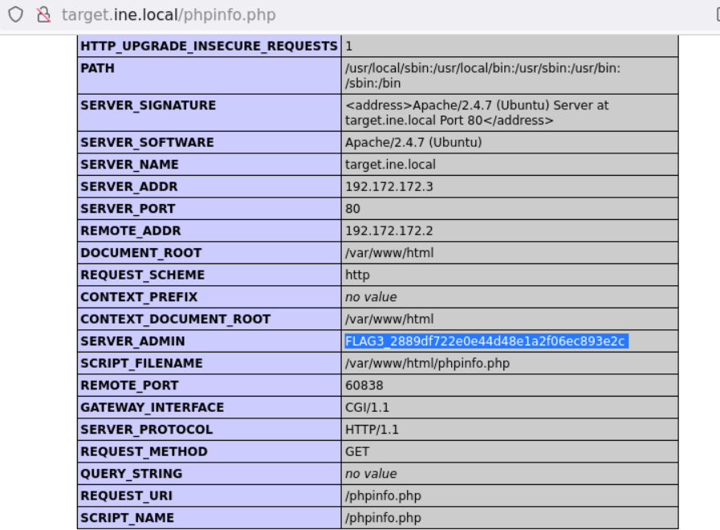

We successfully found the fla3

---------------------------------------------THE END----------------------------------------------------------------------

