Lab Environment:
A target machine is accessible at target.ine.local. Identify the services and capure the flags.

Flag 1: An insecure ssh user named alice lurks in the system.

Flag 2: Using the hashdump file discovered in the previous challenge, can you crack the hashes and compromise a user?

Flag 3: Can you escalate privileges and read the flag in C://Windows//System32//config directory?

Flag 4: Looks like the flag present in the Administrator's home denies direct access.
The following will be useful:

Wordist: /usr/share/wordlists/metasploit/unix_passwords.txt

Tool: /root/Desktop/PrintSpoofer.exe

## Lets Start with an Nmap Scan on target.ine.local

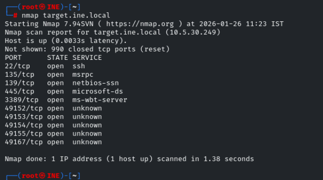

lets perform default script scan and service version detection scan on them 

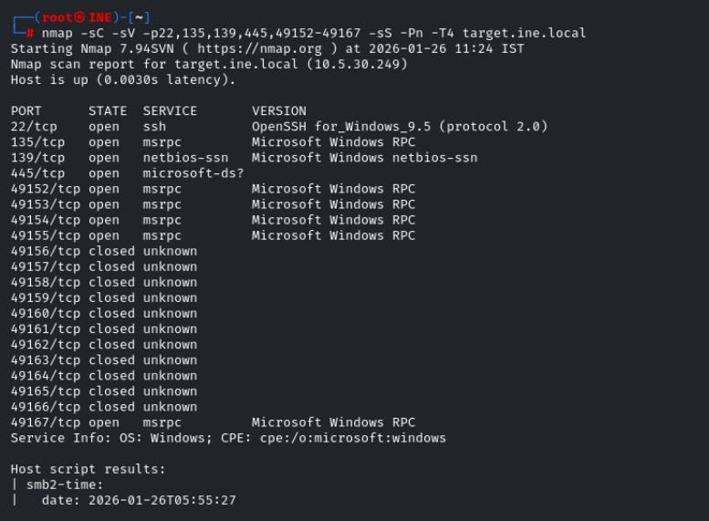
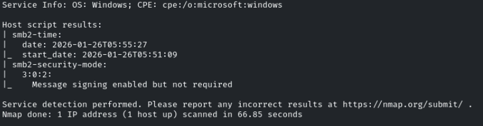

We found the username alice so lets crack the password using hydra over ssh 

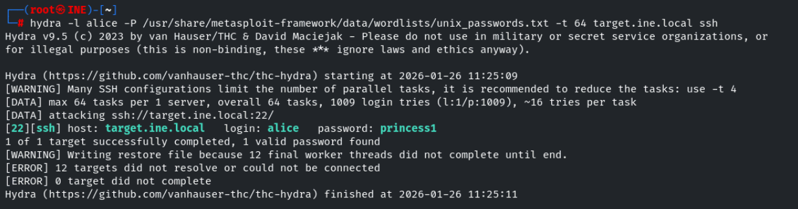

We successfully found the alice password 

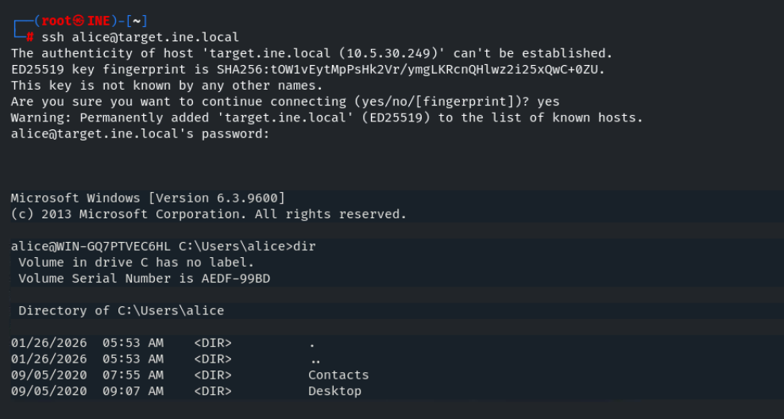

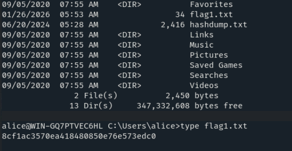

We successfully found the flag1.txt and now lets view the hashdump.txt 

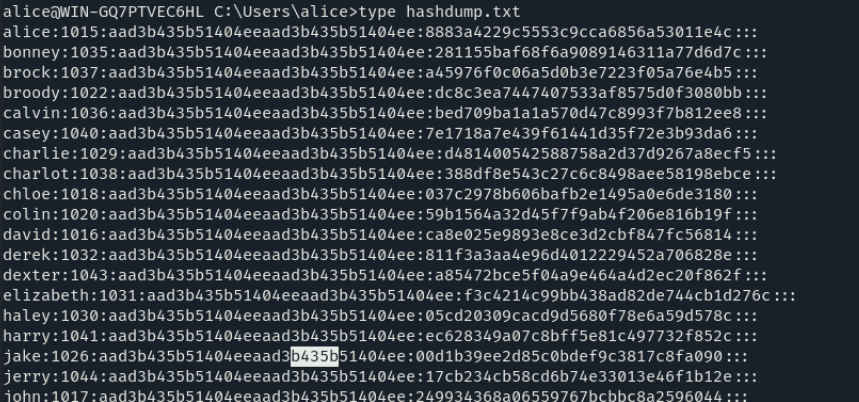

The hashes are in NT format , lets copy them in a file and crack it using john

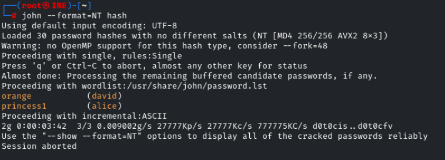

for user david we successfully found the password , lets login with this credentials over ssh 

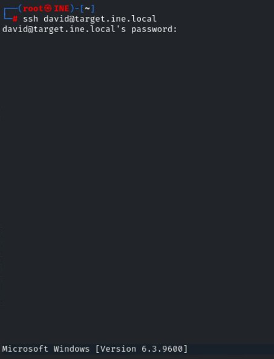

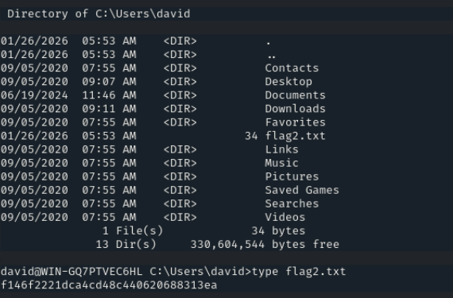

We successfully found the flag2.txt , now lets see our privilages using command : whoami /priv

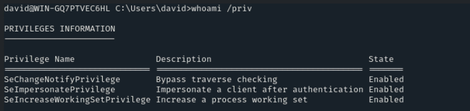

SeImpersonatePrivilege is enabled

we has SeImpersonatePrivilege  has one of our privilage 

we can use PrintSpoofer.exe to esclate to higher privilage with SeImpersonatePrivilege

PrintSpoofer is in our kali desktop folder , lets use scp to copy it to the windows system 

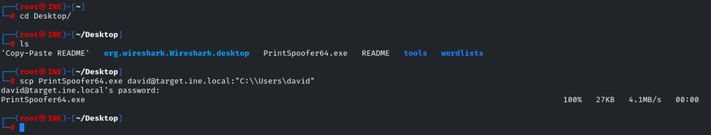

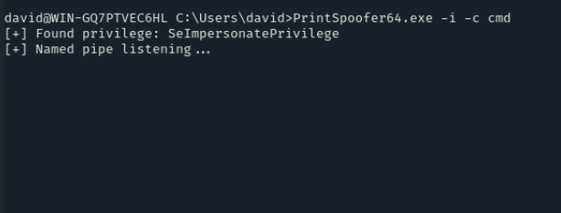

We successfully esclated our privilages , now lets view the config folder 

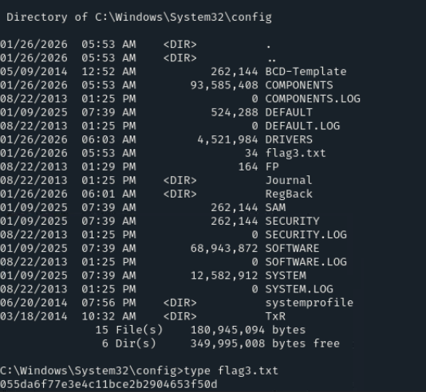

We successfully found the flag3.txt 

Now lets check the Adminstrator folder 

for flag folder the access is denied even though we are in the highest privilage 

icacls command is used the permission of a file or folder 

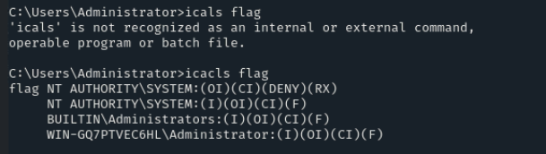

We can see that the access is denied to NT AUTHORITY SYSTEM USER 

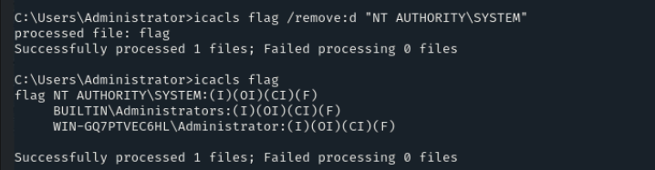

remove:d → remove DENY rule

Target → NT AUTHORITY\SYSTEM

Result → permission restriction removed

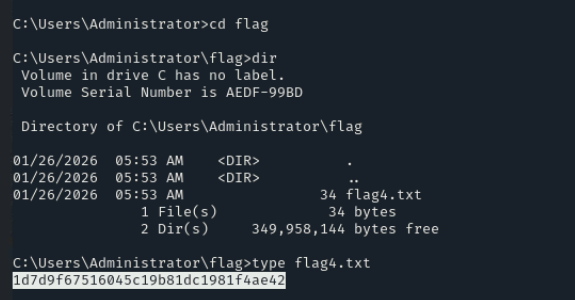

We Successfully found the flag4.txt 

----------------------------------------------------------------------THE END---------------------------------------------------------------------------------

