Lab Environment:

In this lab environment, you will have GUI access to a Kali Linux machine. Two machines are accessible at target1.ine.local and target2.ine.local.

Objective: Using various exploration techniques, complete the following tasks to capture the associated flags:

Flag 1: Enumerate the open port using Metasploit, and inspect the RSYNC banner closely; it might reveal something interesting.

Flag 2: The files on the RSYNC server hold valuable information. Explore the contents to find the flag.

Flag 3: Try exploiting the webapp to gain a shell using Metasploit on target2.ine.local.

Flag 4: Automated tasks can sometimes leave clues. Investigate scheduled jobs or running processes to uncover the hidden flag.

## Lets start with an Nmap scan on target1.ine.local 

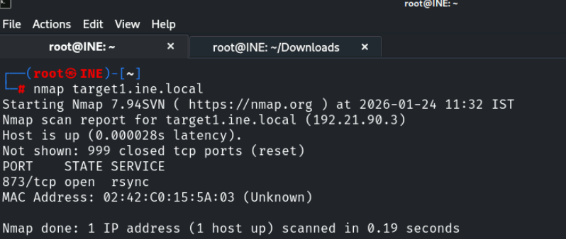

we found rsync port is open , lets perform service verison detection and default script scan on it 

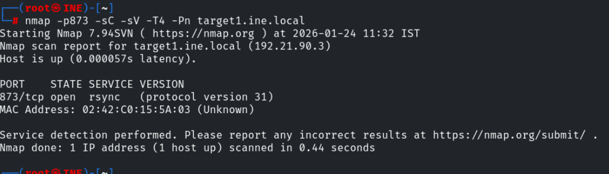

rsync is used to copy and synchonizing files and folders 

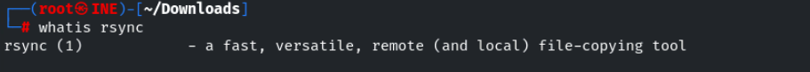

for more info command : rsync --help

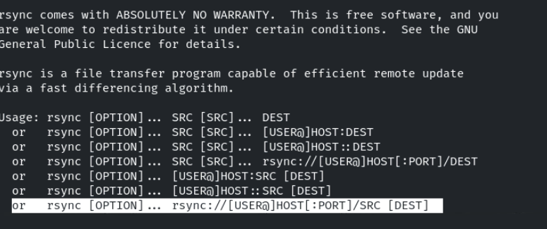

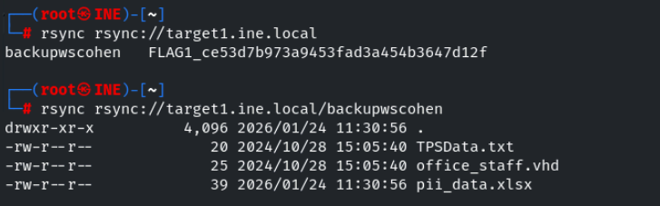

We successfully found the flag1 and there is a folder lets copy the contents of it to our kali machine  

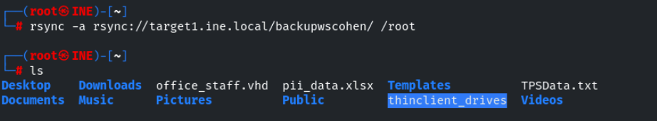

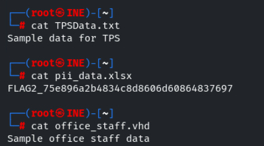

We successfully found the flag2 

## Lets start with an Nmap scan on target2.ine.local

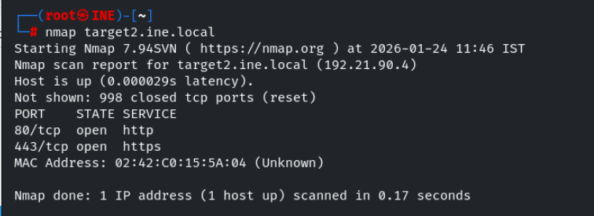

found http and https ports are open , lets perform service verison detection scan and default script scan on them , lets also use http-enum script to ememurate more information

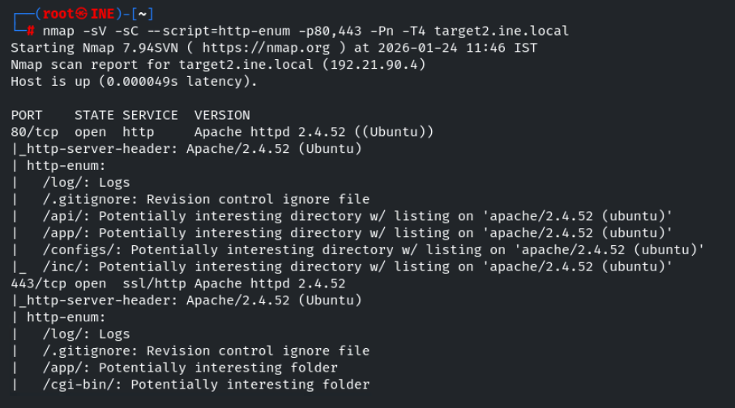

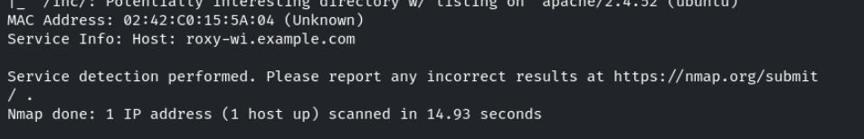

Lets visit the site running on port 80 as well as port 443 

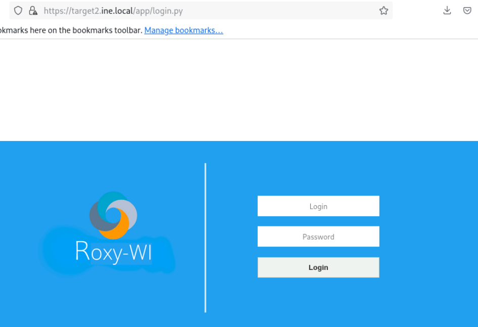

Roxy-WI (Roxy Web Interface) is an open-source GUI designed for managing and monitoring HAProxy, NGINX, Apache, and Keepalived servers in one place

Lets use msf to search for modules for roxywi

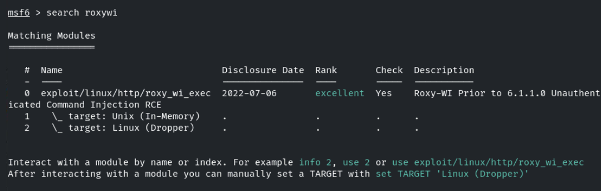

found one exploit it , lets try it 

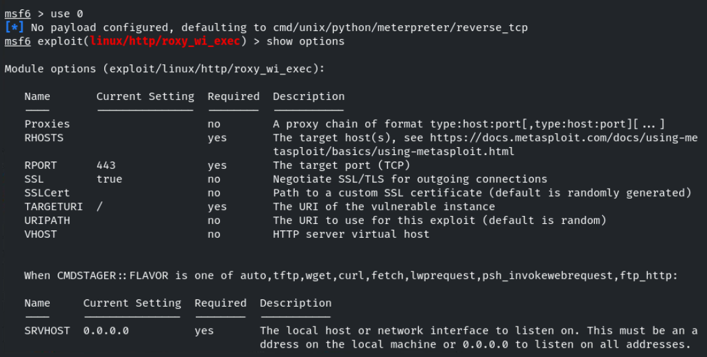

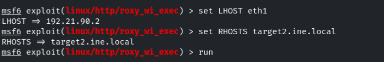

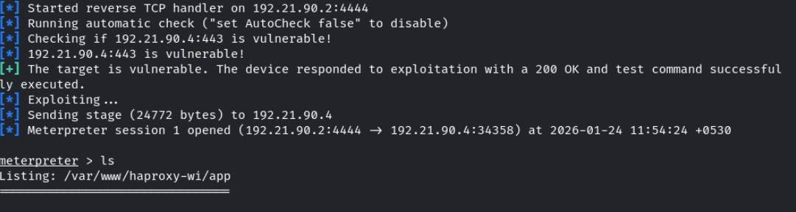

In the root directory / found the flag3 

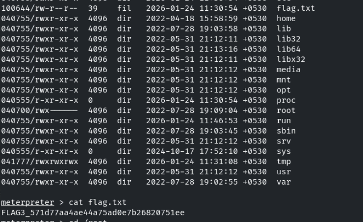

Automated tasks can sometimes leave clues. Investigate scheduled jobs or running processes to uncover the hidden flag.

Lets visit the crontab in /etc folder 

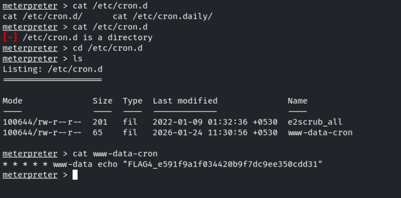

We successfully found the flag4 

------------------------------------------THE END---------------------------------------------------------

