Two Linux machines are accessible at target1.ine.local and target2.ine.local. Identify the application and service running on these machines, and capture the flags. The flag is an md5 hash format.

Flag 1: Identify and exploit the vulnerable web application running on target1.ine.local and retrieve the flag from the root directory. The credentials admin:password1 may be useful.

Flag 2: Further, identify and compromise an insecure system user on target1.ine.local.

Flag 3: Identify and exploit the vulnerable plugin used by the web application running on target2.ine.local and retrieve the flag3.txt file from the root directory.

Flag 4: Further, identify and compromise a system user requiring no authentication on target2.ine.local.

The following wordlists will be useful:

/usr/share/nmap/nselib/data/wp-plugins.lst

/usr/share/metasploit-framework/data/wordlists/unix_passwords.txt

Tools:

Nmap,
Hydra,
Dirb,
Python3,
Metasploit

## Lets start with an Nmap scan on target1.ine.local 

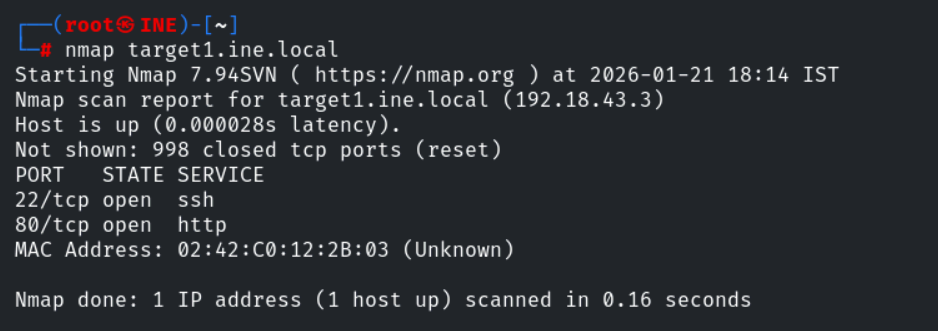

we found two open ports , lets perform service version detection and default script scan on them

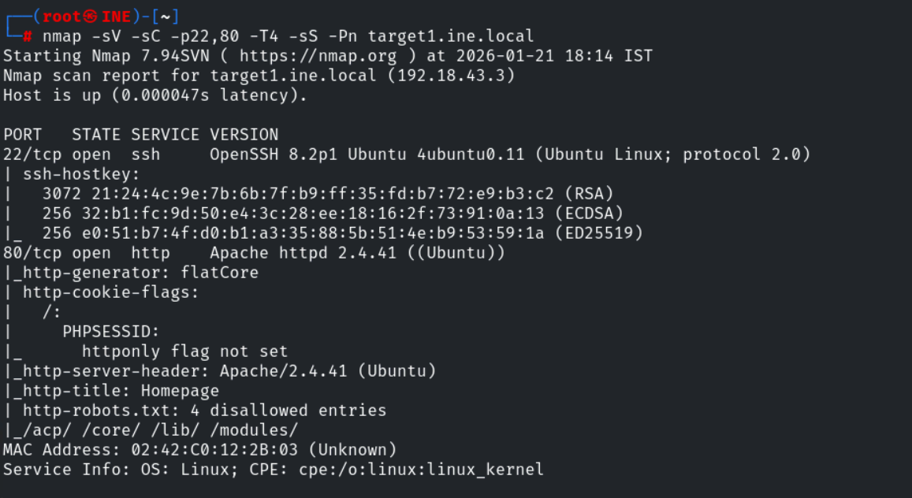

using script http-enum to enemurate more information

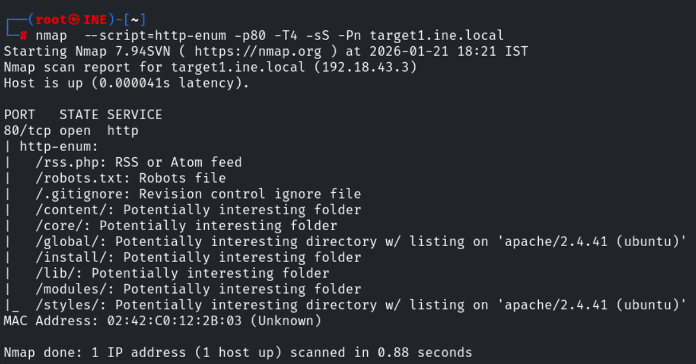

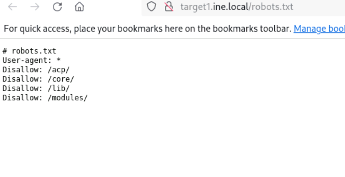

in /acp found a login page

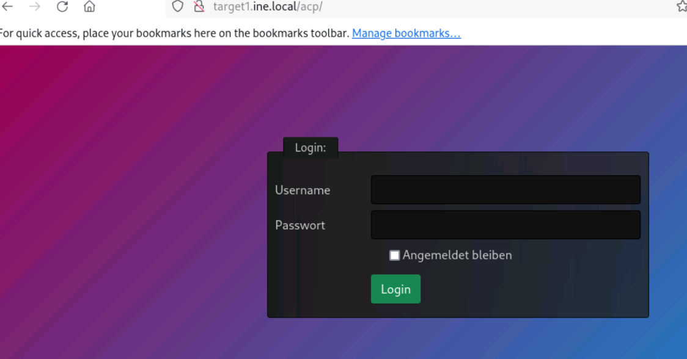

lets login with the credentials given to us 

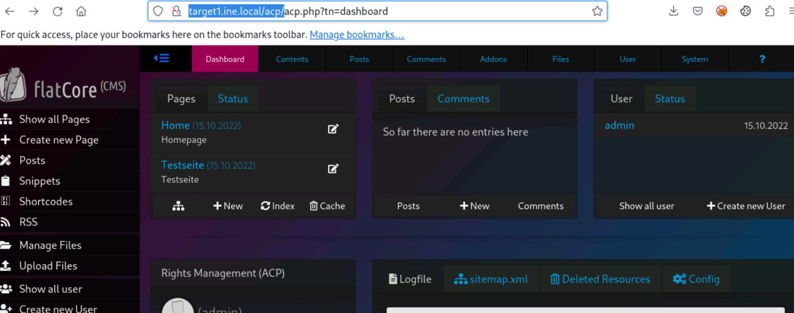

the cms used here is flatcore , lets search for its exploit ,Lets copy the exploit to our current working directory 

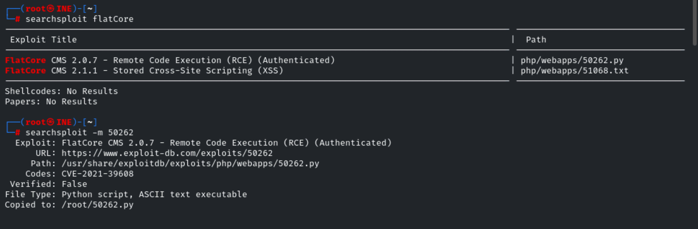

Lets use that exploit with our credentials 

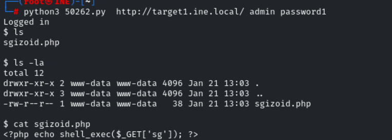

we cant able to switch directory with cd , so we can list the contents with ls

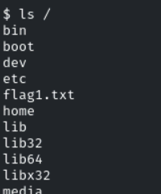

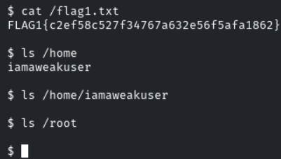

We found a user named iamaweakuser , we know that ssh port is open , lets use hydra to crack the password of the user over ssh

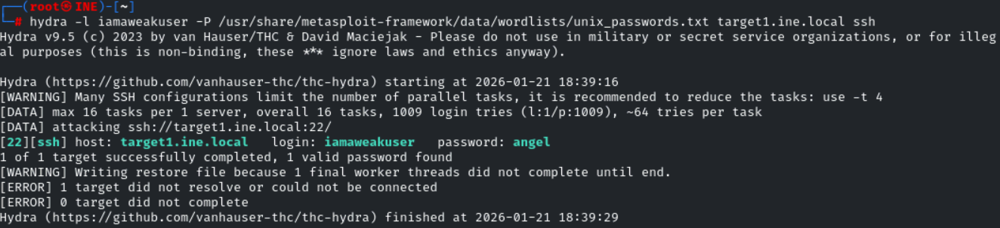

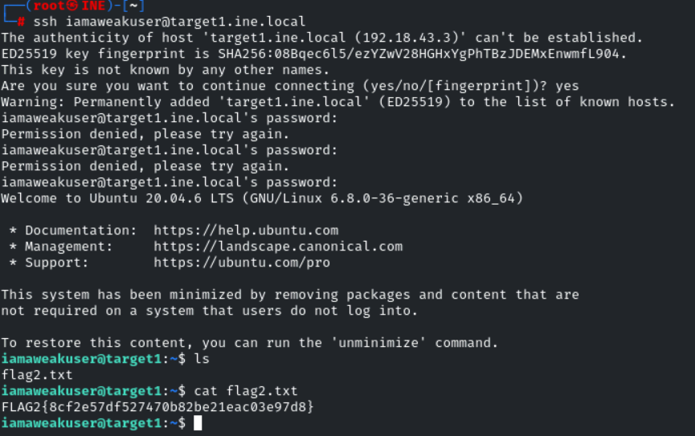

We successfully found the flag1 and flag2

## Lets start with the Namp Scan on target2.ine.local

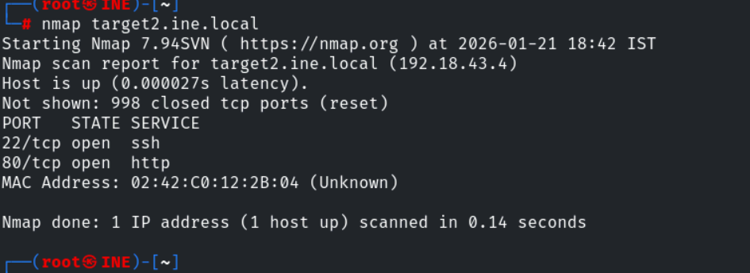

lets perform service verson detection and defualt script scan on them

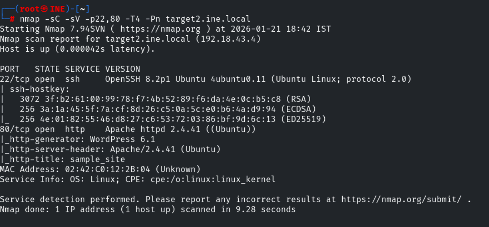

lets use gobuster to enemurate the webdirectories

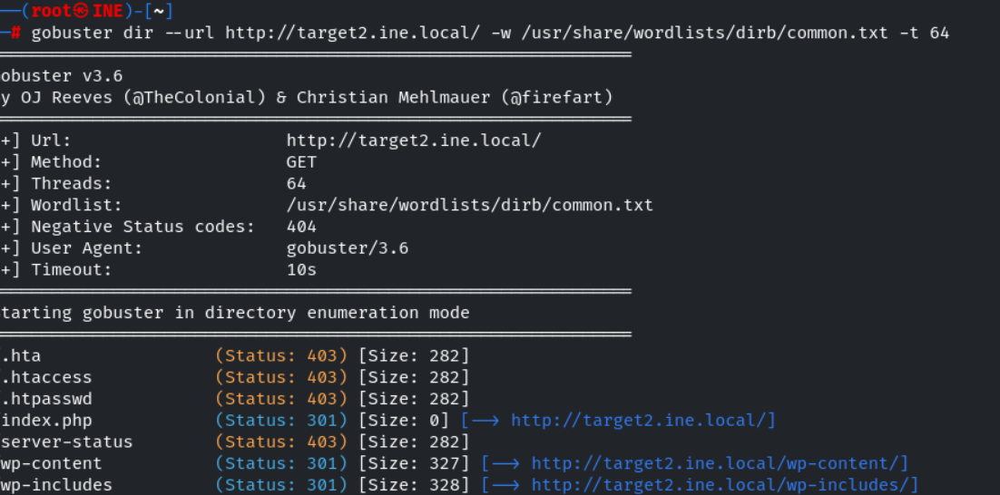

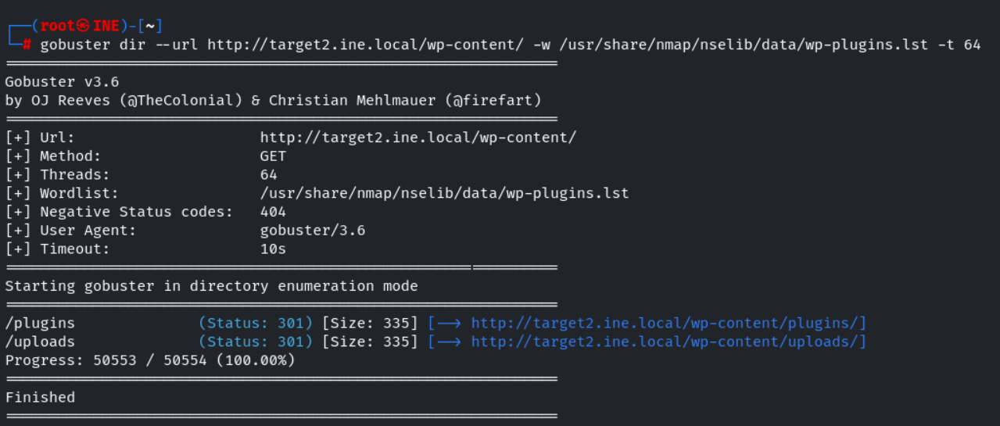

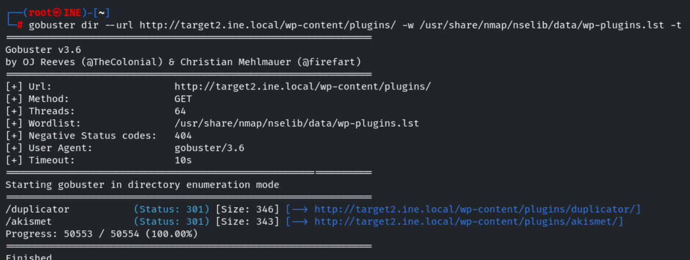

We found two plugins duplicator and akismet

lets find for the exploit for this vulnerability 

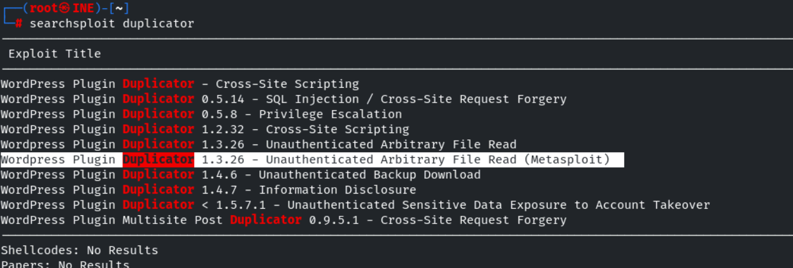

There is a msf module , lets use that 

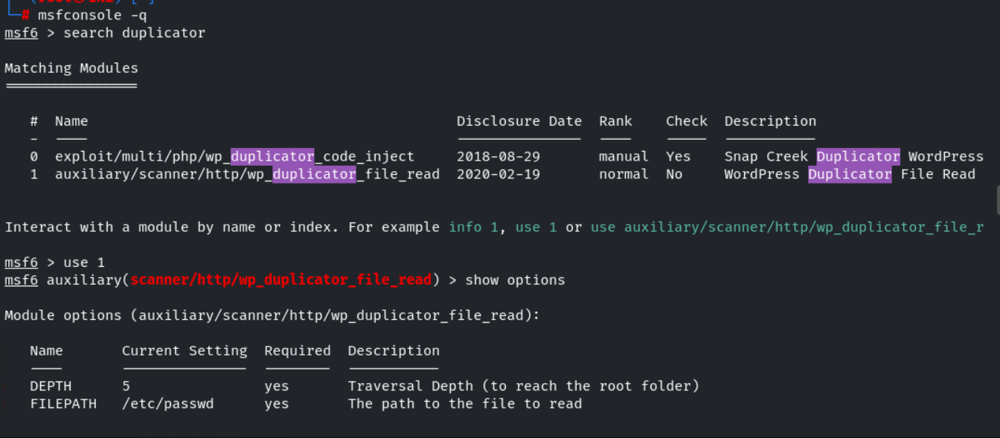

the default filepath is set to /etc/passwd , lets set the rhosts and run it 

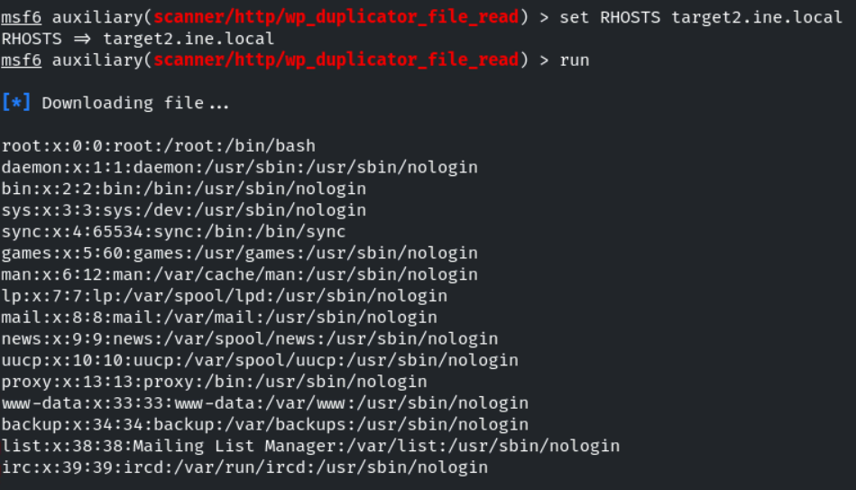
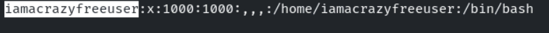

We found a user 

now lets read the flag3.txt file --> assumption 

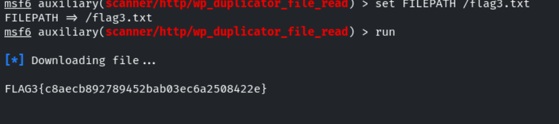

Flag 4: Further, identify and compromise a system user requiring no authentication on target2.ine.local.

lets login into ssh with the username we found 

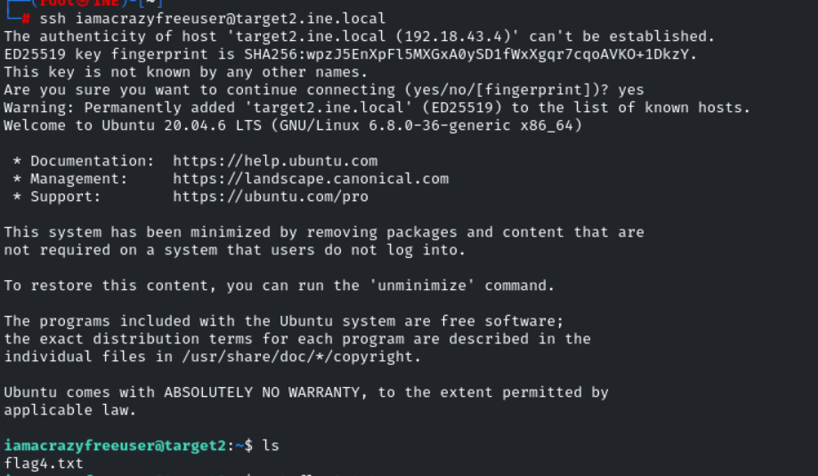

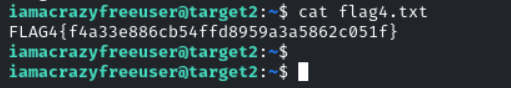

