A target machine is accessible at target.ine.local. Identify the services and capure the flags.

Flag 1: Looks like smb user tom has not changed his password from a very long time.

Flag 2: Using the NTLM hash list discovered in the previous challenge, can you compromise the smb user nancy?

Flag 3: I wonder what the hint found in the previous challenge be useful for!

Flag 4: Can you compromise the target machine and retrieve the C://flag4.txt file?

The following wordlist will be useful: /usr/share/wordlists/metasploit/unix_passwords.txt

## Lets start with An nmap scan 

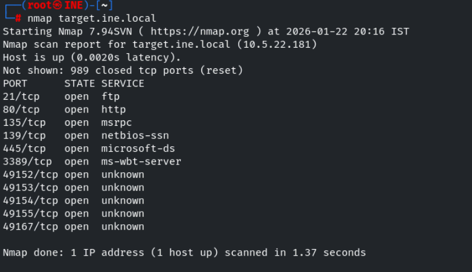

Lets perform service detection scan and default script scan 

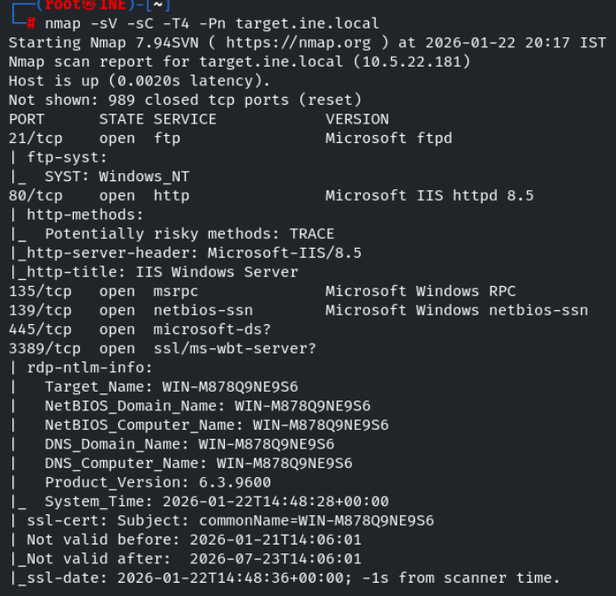

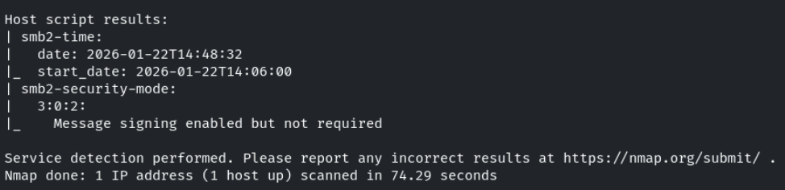

lets use gobuster to enemurate web directories on site running on port 80

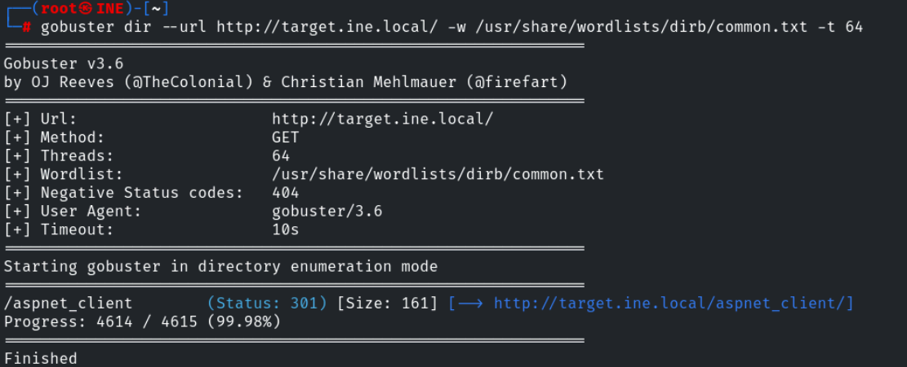

we cant able to access the /path we found 

in question smb username is given , lets enemurate for his password 

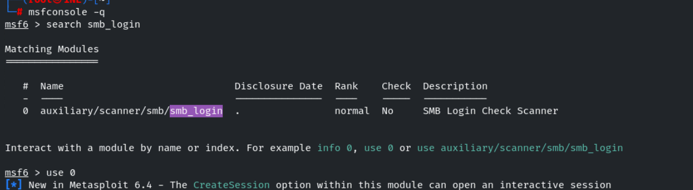

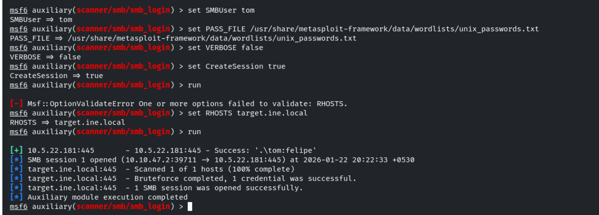

we found the password for user tom and a session is created , lets interact with it 

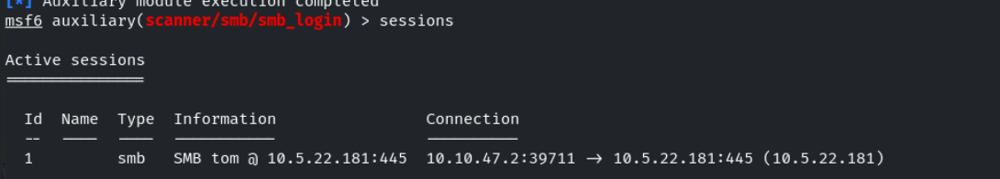

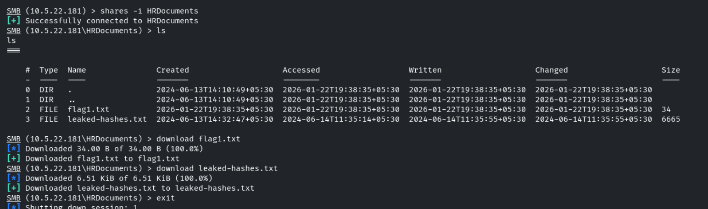

We have found two files leaked_hashes.txt and flag1.txt

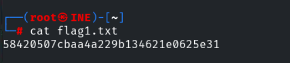

set use pass_file as leaked_hashes.txt and smbuser as nancy and enemurate the shares

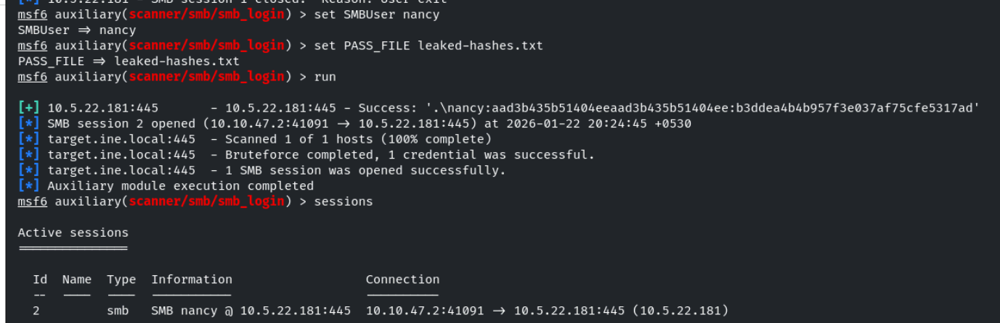

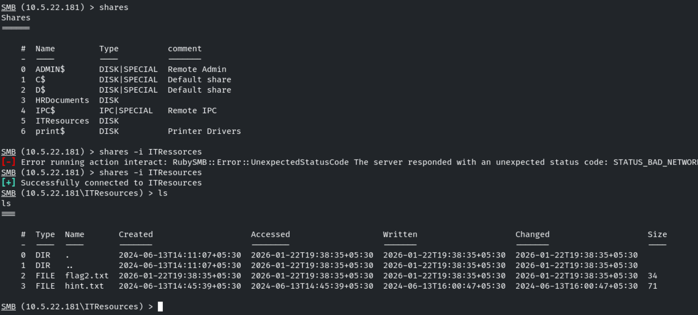

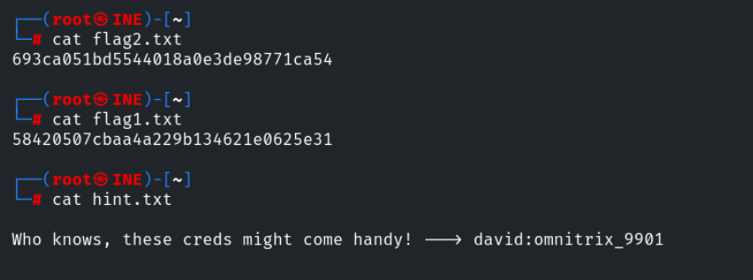

since ftp port is open , lets use this credentials to try to login into ftp

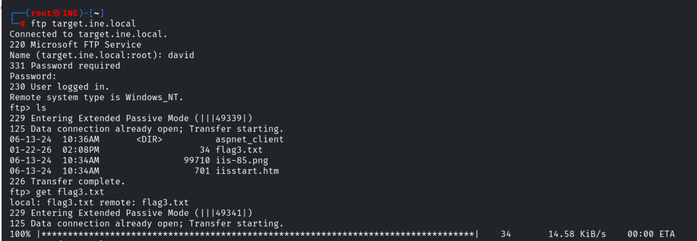

we found the flag3 

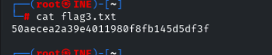

in the ftp there is a file named aspnet_client which is shown in our gobuster , therefore it seems like ftp is integrated with http site which is running on port 80

lets create a payload with .aspx since it is a windows machine and upload it in ftp

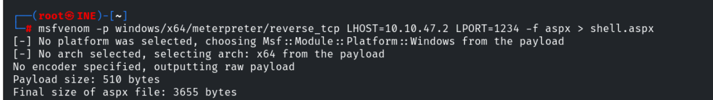

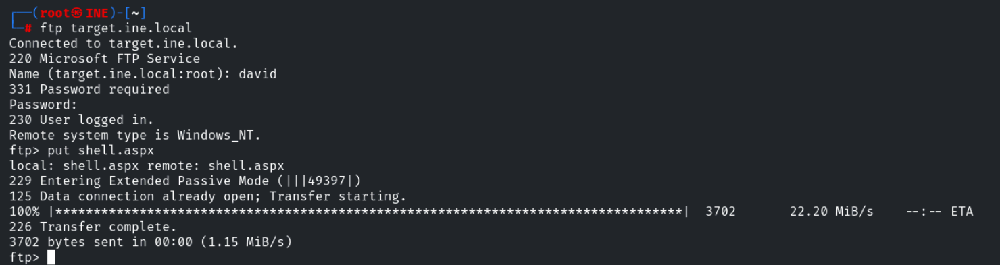

use multi/handler to listen for connection from the shell.aspx

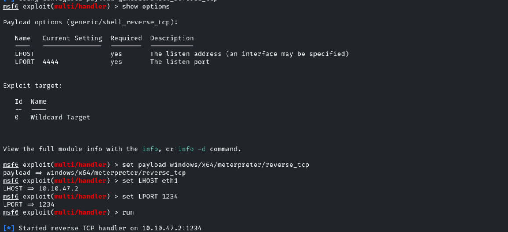

access the url: http://target.ine.local/shell.aspx

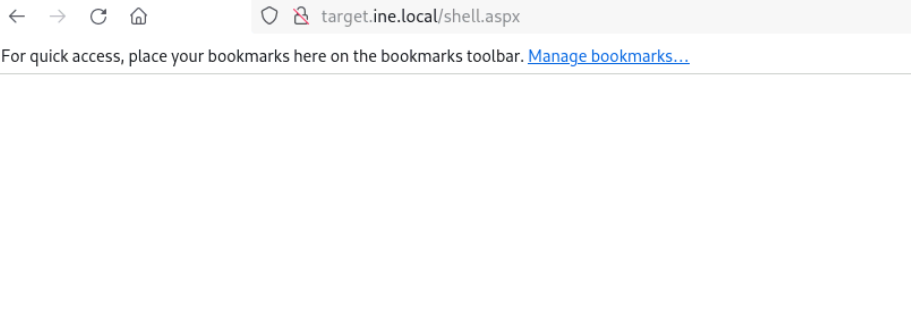

We successfully got the meterpreter session and found the flag 

------------------------------------------------------------------------------------------------

