Two machines are accessible at target1.ine.local and target2.ine.local. Enumerate the targets, identify and exploit the misconfigurations or vulnerabilities to capture the flags. The flag is in an md5 hash format.

Flag 1: A vulnerable service maybe running on target1.ine.local. If exploitable, retrieve the flag from the root directory.

Flag 2: Further, a quick interaction with a local network service on target1.ine.local may reveal this flag. Use the hint given in the previous flag.

Flag 3: A misconfigured service running on target2.ine.local may help you gain access to the machine. Can you retrieve the flag from the root directory?

Flag 4: Can you escalate to root on target2.ine.local and read the flag from the restricted /root directory?

## Lets start with An nmap on target1.ine.local

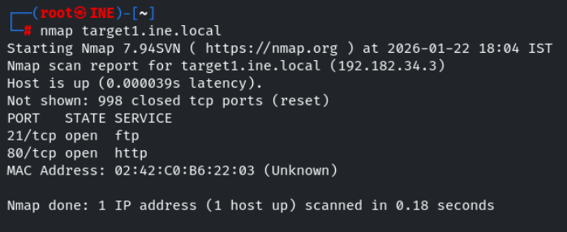

we found two open ports , lets perform service verion detection and default script scan on them

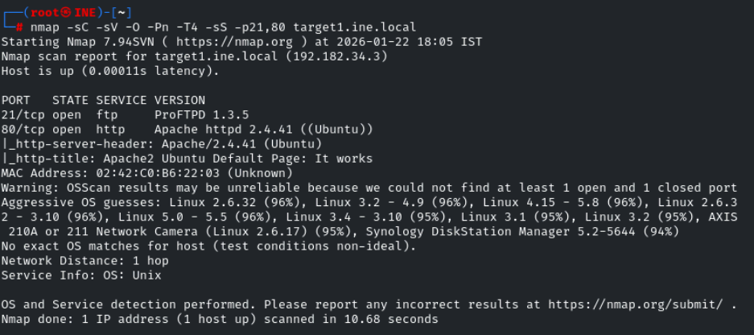

lets visit the site running on port 80 

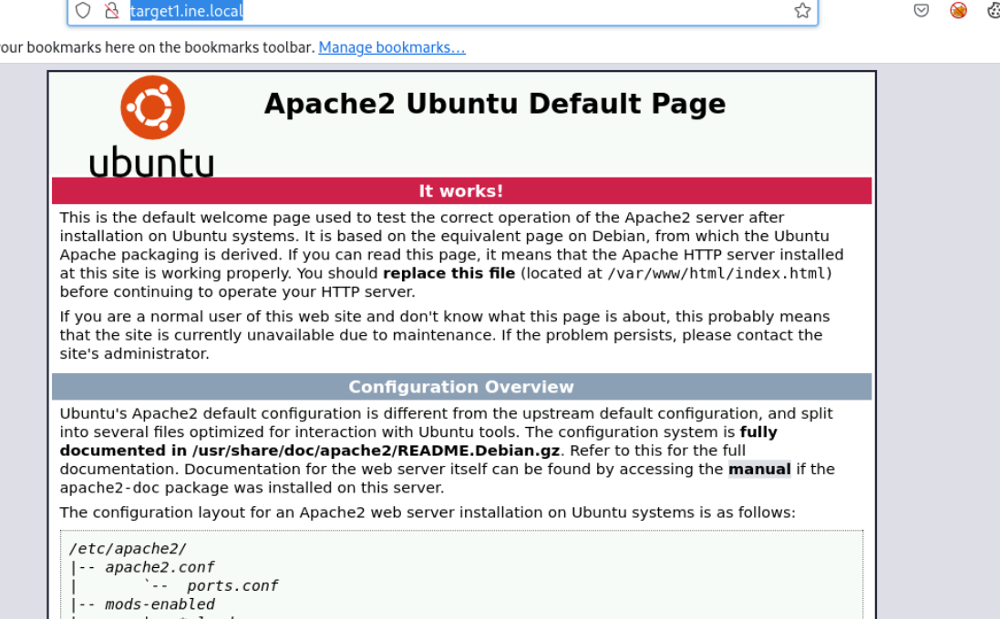

seems ftp version is vulnerable 

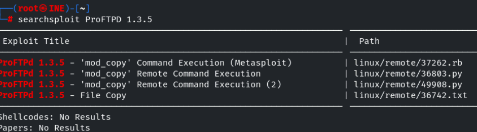

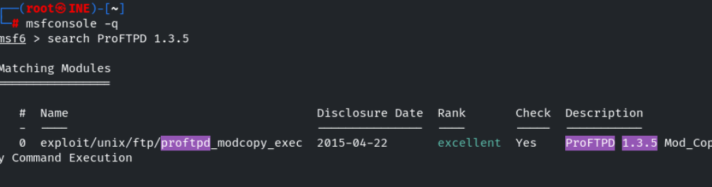

set RHOSTS to eth1 , SITEPATH TO /var/www/html 

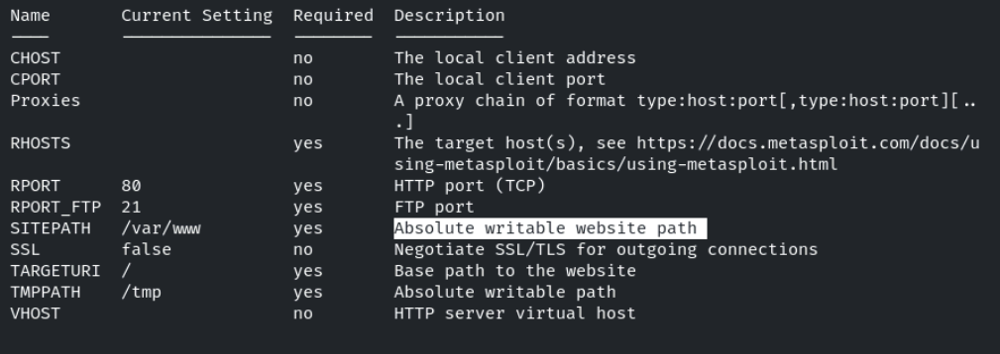

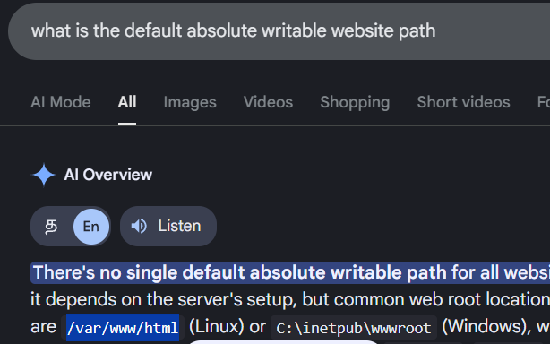

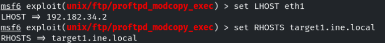

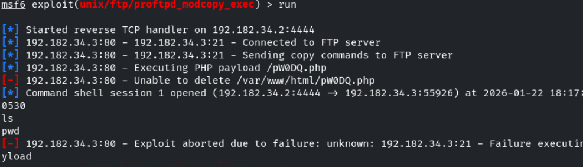

it showed the exploit has failed but it created a session 

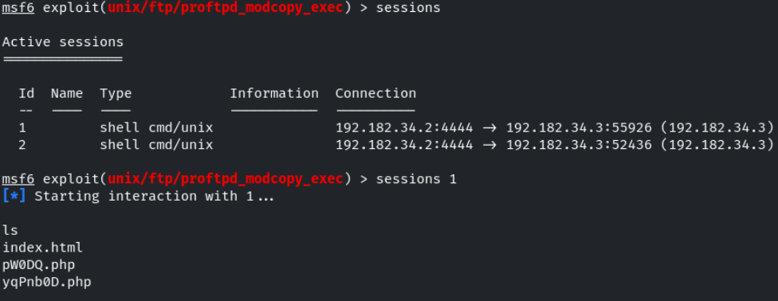

lets interact with the sessions

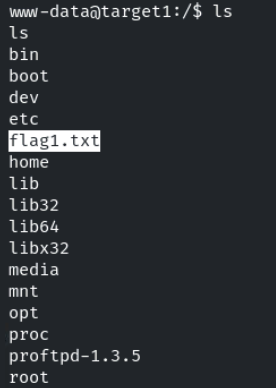

Flag 2: Further, a quick interaction with a local network service on

to check the local services running in the system

command : netstat -tuln 

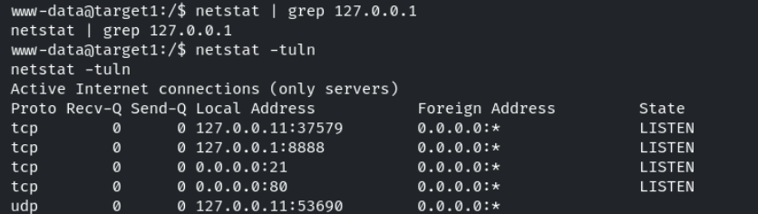

lets connect to the open 8888 using netcat 

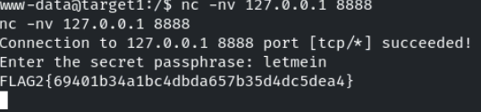

We successfully found the flag1 and flag2 

## Lets start with An nmap on target2.ine.local

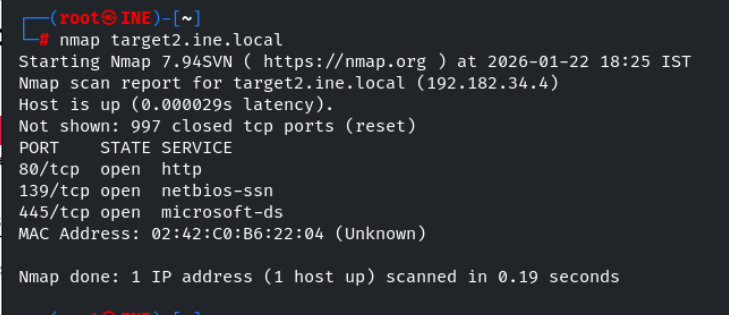

we found three open ports , lets perform service verion detection and default script scan on them

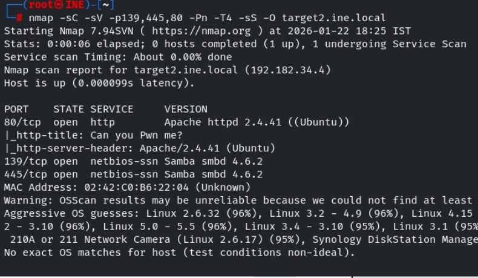

Lets use enum4linux to enermuate more informaation about smb like usernames ,shares etc ..

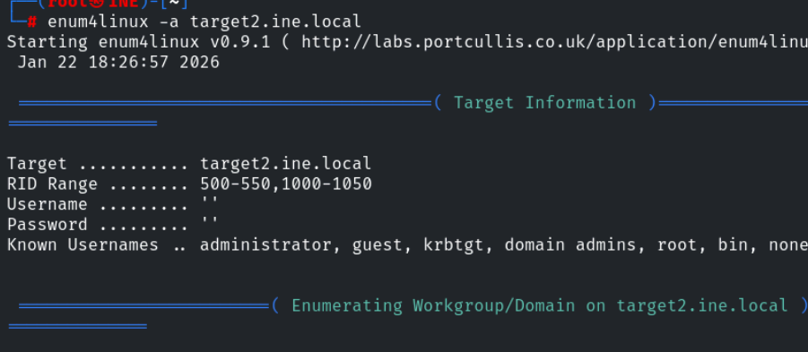

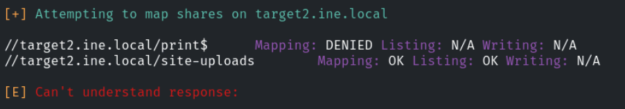

we found a share , lets inteact with it using smbclient 

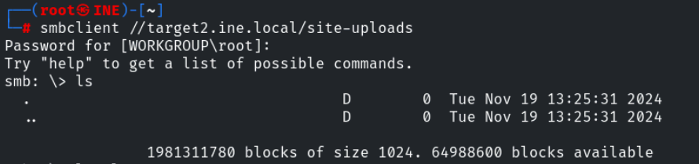

seems like we can able to access /site-uploads in site running on port 80

lets upload a php-reverse-shell

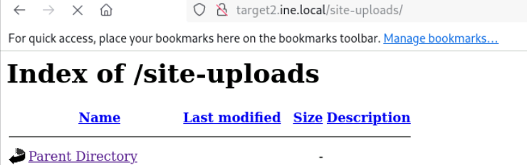

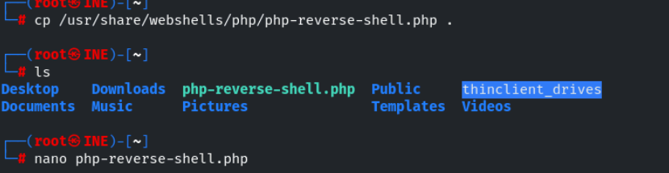

upload the php-reverse-shell in smb using command put 

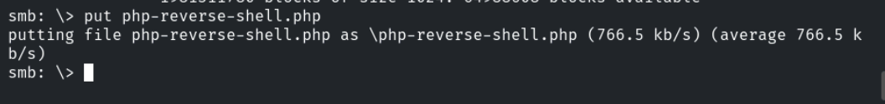

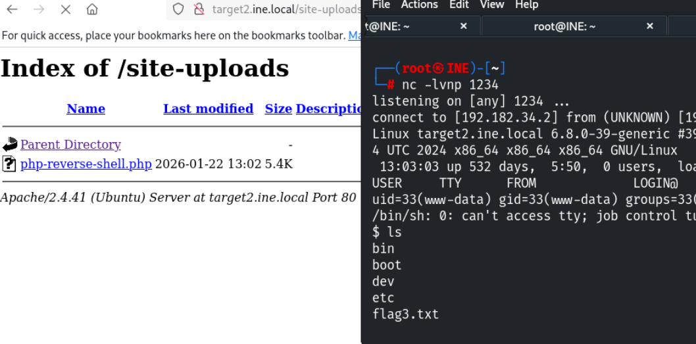

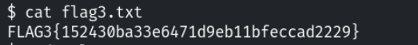

lets escalte our privilage , we cant able to run sudo -l and no juicy is found in crontab 

so lets check for suid files 

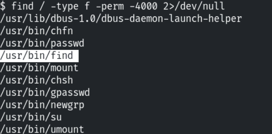

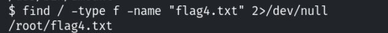

lets use gtfo bins for exploiting suid privilages for find command 

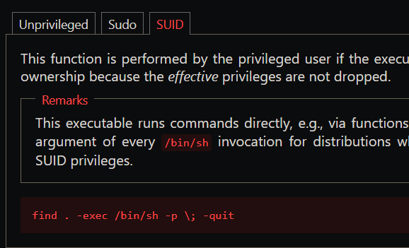

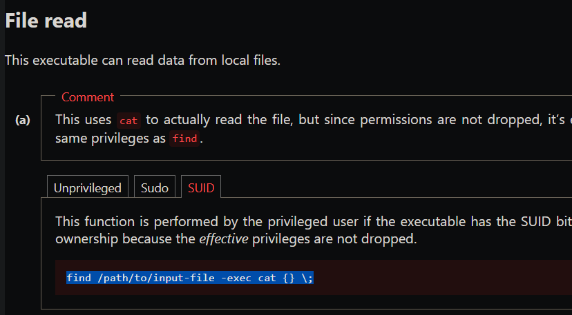

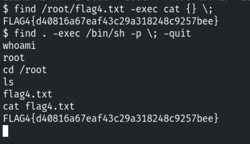
