In this lab environment, you will be provided with GUI access to a Kali Linux machine. Two machines are accessible at http://target1.ine.local and http://target2.ine.local.

Objective: Execute Post-Exploitation techniques on the target to uncover hidden flags and fully exploit the compromised environment.

Flags to Capture:

Flag 1: The file that stores user account details is worth a closer look. (target1.ine.local)

Flag 2: User groups might reveal more than you expect.

Flag 3: Scheduled tasks often have telling names. Investigate the cron jobs to uncover the secret.

Flag 4: DNS configurations might point you in the right direction. Also, explore the home directories for stored credentials.

Flag 5: Use the discovered credentials to gain higher privileges and explore the root's home directory on target2.ine.local.

## Lets start with an Nmap scan on target1.ine.local

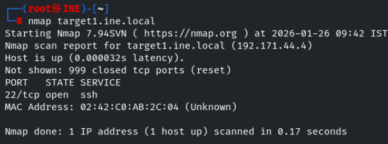

we found ssh port is open , lets perform service version detection scan and defualt script scan on it 

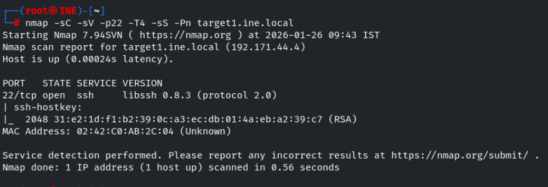

ssh version seems to be vulnerable , lets search for modules in msf

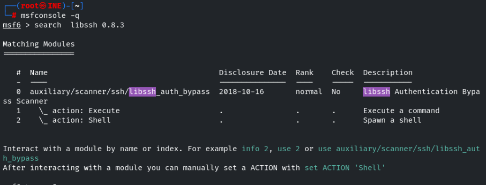

Lets use that module for libssh 

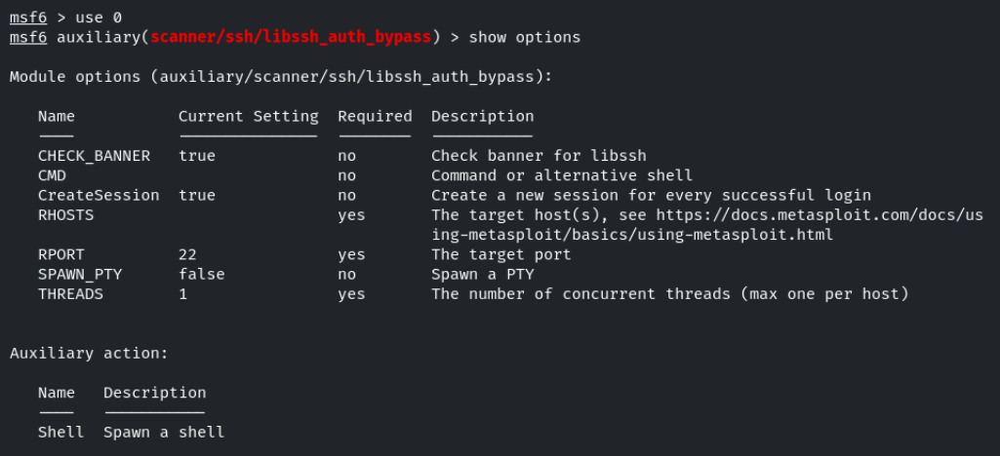

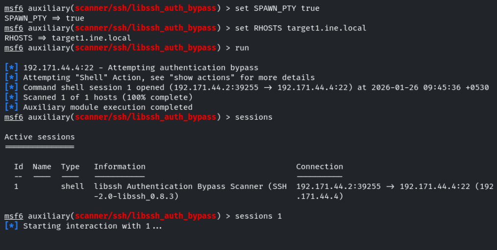

A session has been created , lets interact with it 

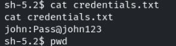

im home and in user directory found a credentials for user john 

Flag 1: The file that stores user account details is worth a closer look. (target1.ine.local)

lets vistis the /etc/passwd file 

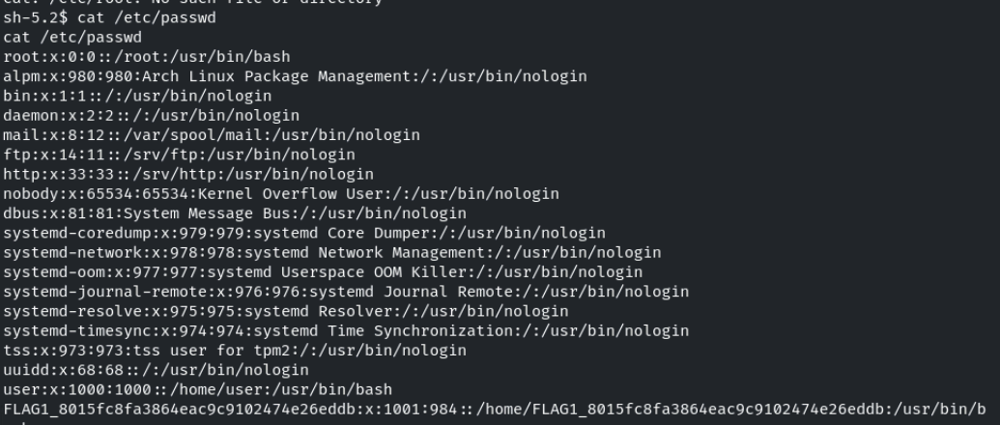

Flag 2: User groups might reveal more than you expect.

lets vistis the /etc/group file 

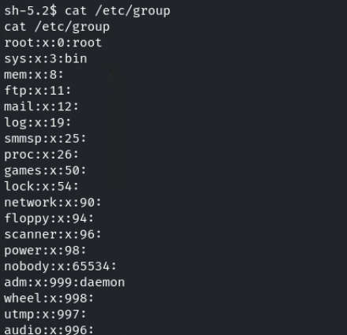
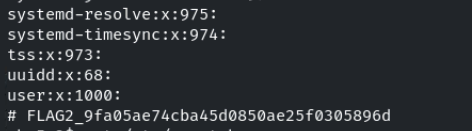

We successfully found the flag1 and flag2 

Schedule tasks and automating tasks always mean for cron jobs , lets visit it 

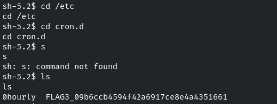

Flag 4: DNS configurations might point you in the right direction. Also, explore the home directories for stored credentials.

The default location for the primary DNS configuration file in linux is /etc/resolv.conf

lets visit it 

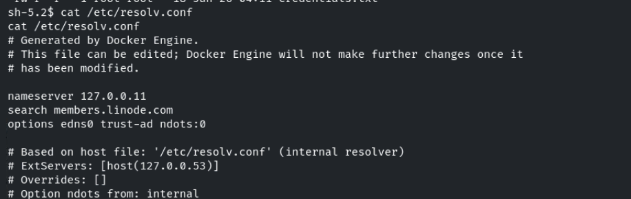

it points to the hosts file 

so lets visit /etc/hosts 

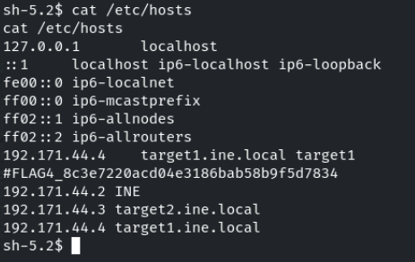

We successfuly found the flag3 and flag4 

## Lets start with an Nmap scan on target2.ine.local

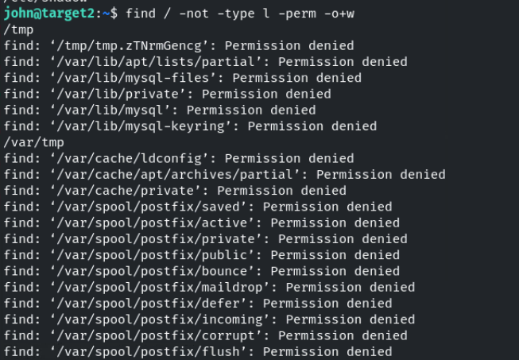

lets perform service version detection and default script scan on the oprn ports 

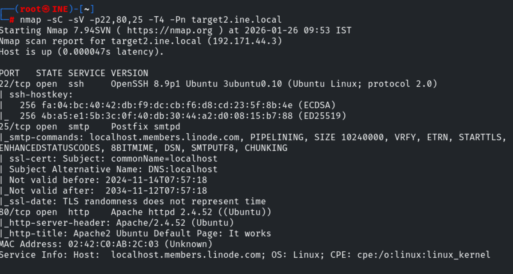

we found the credentials for john user , so lets that to login into ssh on target2.ine.local

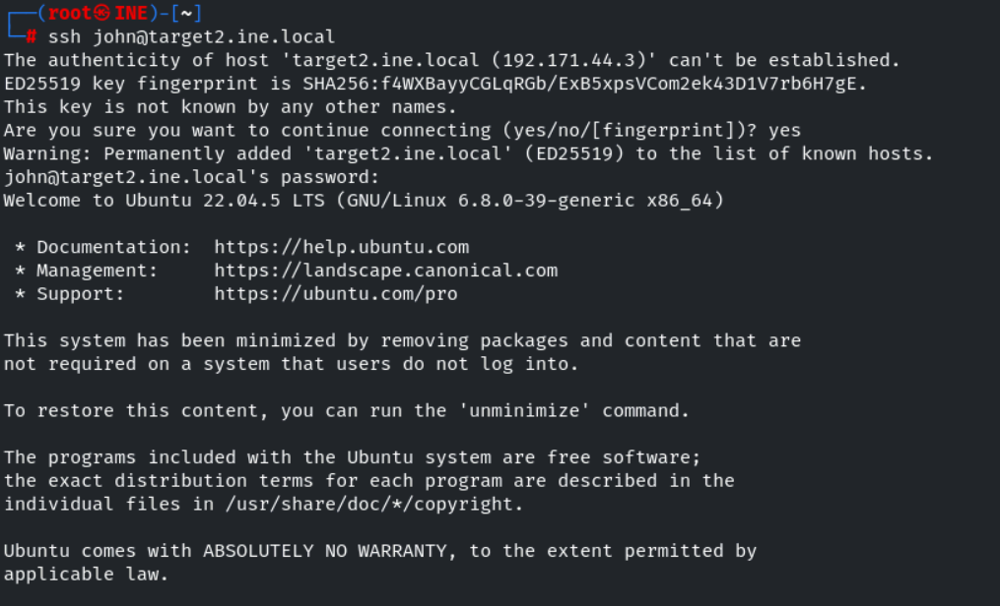

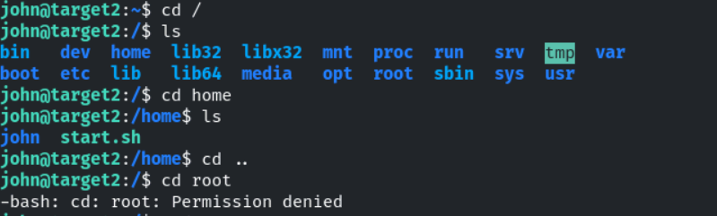

Lets escalate our privilage to get the root flag 

tried sudo -l , searched for suid files , visited crontabs but no juciy information is found 

so lets search for writable files by any users except root(owner) and group 

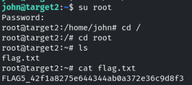

found that /etc/shadow file has a writable permission by other users , lets visit it 

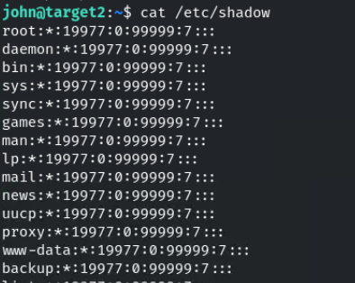

found that root has no password 

* stand for --> no password

lets use openssl to create a hashed password 

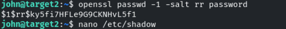

passwd --> wants to create a hashed password

-1 --> uses md5 algorithm for hash

-salt --> adds salt 

copy paste the password in place of * for root 

We successfully found the flag5 

---------------------------------------------THE END---------------------------------------------------------

