Lab Environment

In this lab environment, you will be provided with GUI access to a Kali Linux machine. Two machines are accessible at http://target1.ine.local and http://target2.ine.local.

Objective: Perform system/host-based attacks on the target and capture all the flags hidden within the environment.

Useful files:

/usr/share/metasploit-framework/data/wordlists/common_users.txt, 
/usr/share/metasploit-framework/data/wordlists/unix_passwords.txt,
/usr/share/webshells/asp/webshell.asp

Flags to Capture:

Flag 1: User 'bob' might not have chosen a strong password. Try common passwords to gain access to the server where the flag is located. (target1.ine.local)

Flag 2: Valuable files are often on the C: drive. Explore it thoroughly. (target1.ine.local)

Flag 3: By attempting to guess SMB user credentials, you may uncover important information that could lead you to the next flag. (target2.ine.local)

Flag 4: The Desktop directory might have what you're looking for. Enumerate its contents. (target2.ine.local)

## Lets start with an Nmap scan on target1.ine.local 

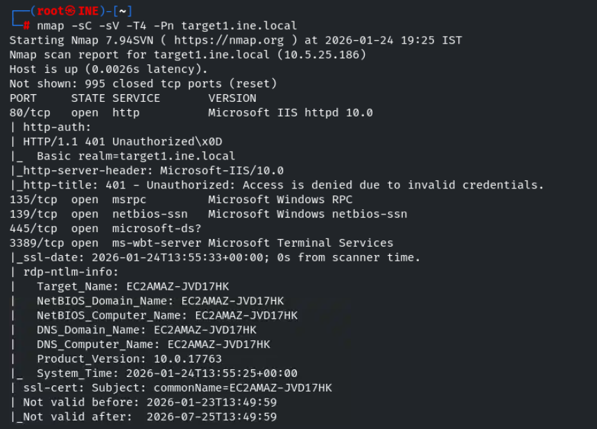
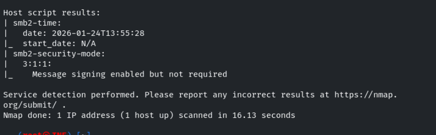

when accessing the site on running on port 80 its pop up a login form , we know the username from the question lets crack the passowrd using hydra

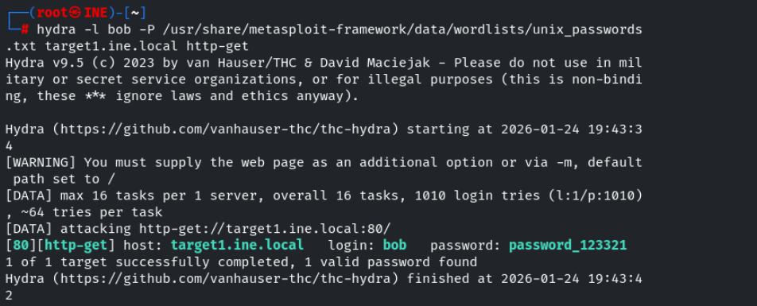

now lets login 

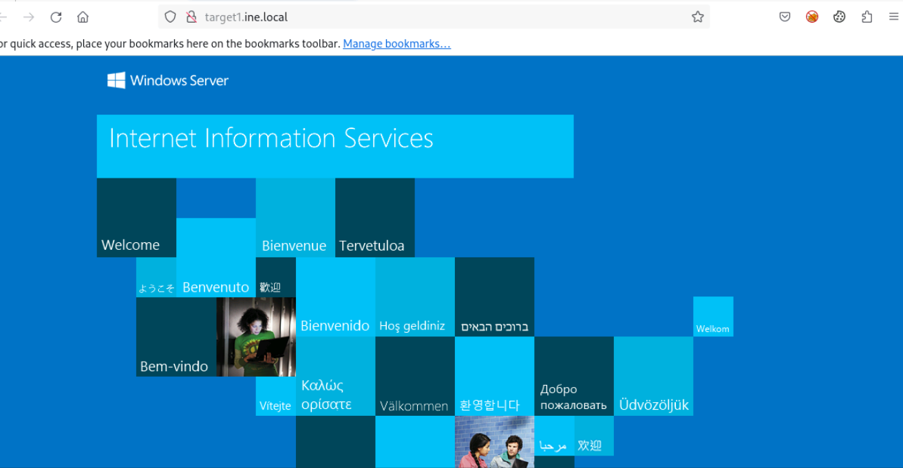

lets enemurate the web directories on the site 

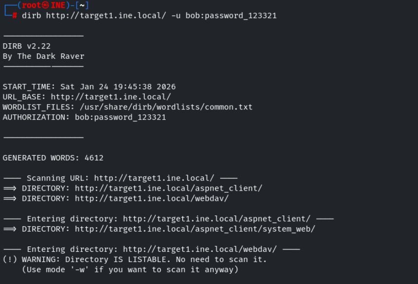

found a directory named webdav , therefore the site is running IIS webdav 

lets use cadaver to interact to with 

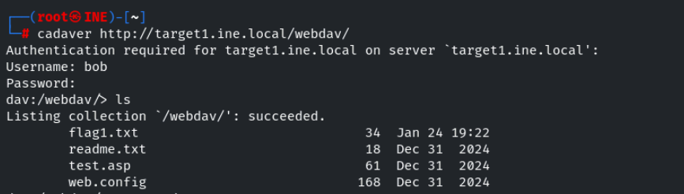

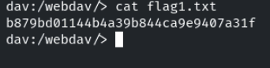

lets use davtest to test which file extension are allowed to upload in the site 

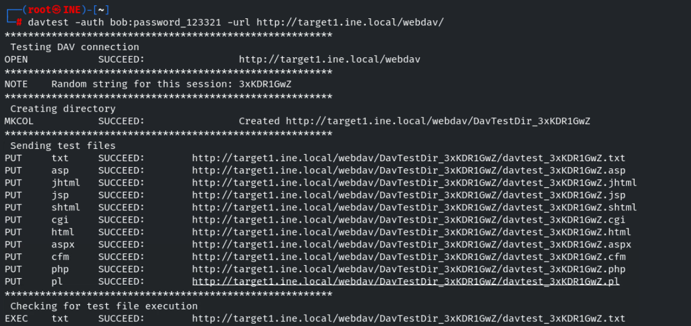

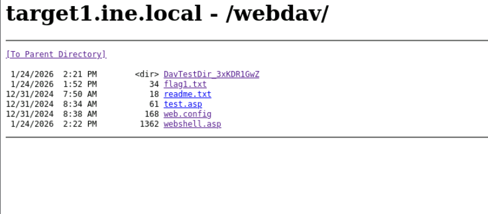

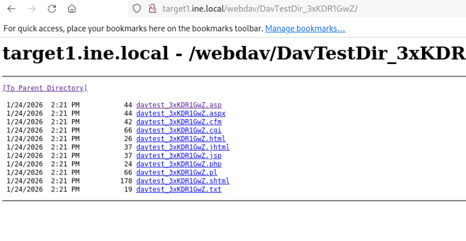

seems like we can able file with .asp extension , so lets upload a webshell.asp 

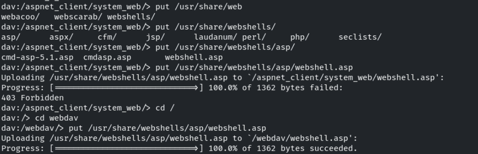

refresh the page and click on webshell.asp

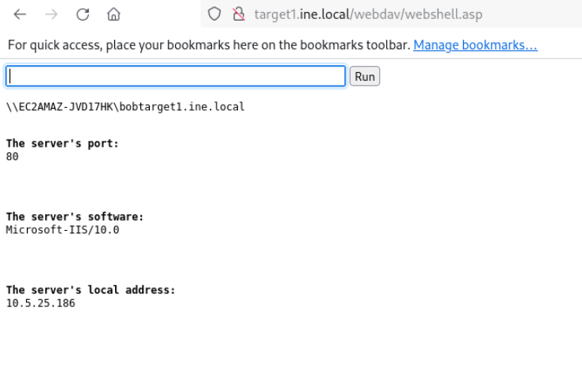

lets see the files on the C: folder command : dir C:\

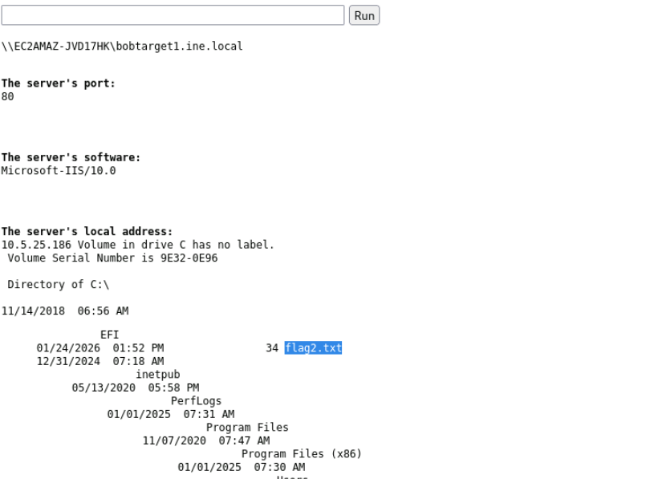

Lets visit the flag2.txt

command : type C:\flag2.txt 

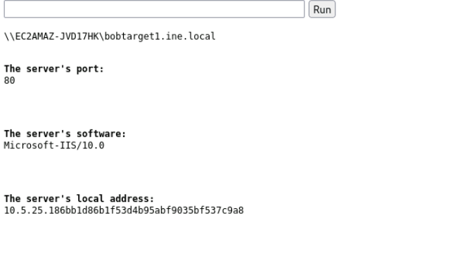

We successfully found the flag1 and flag2 

## Lets start with an Namp Scan on target2.ine.local

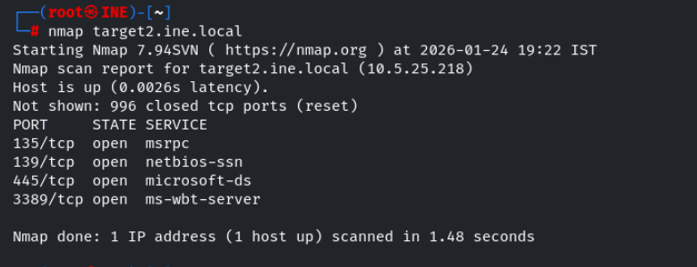

lets perform default script scan and service version detection scan on the open ports we found 

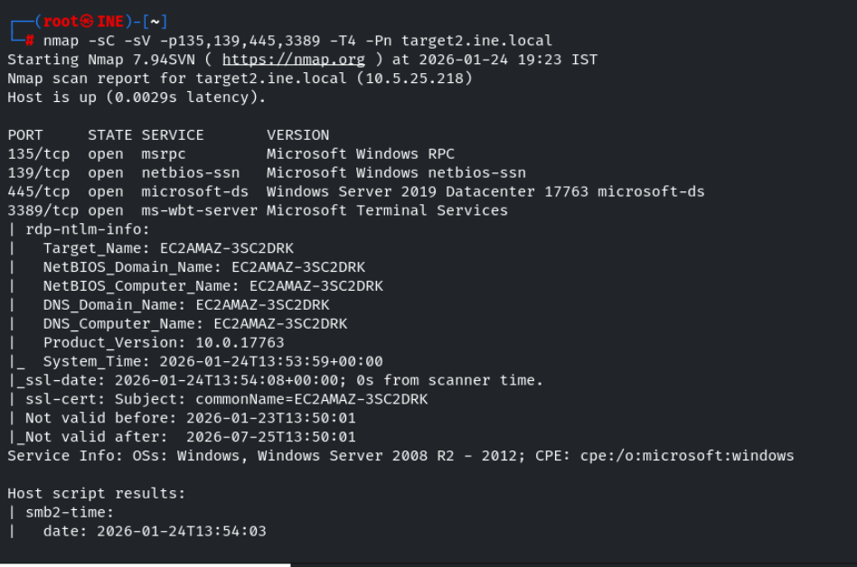
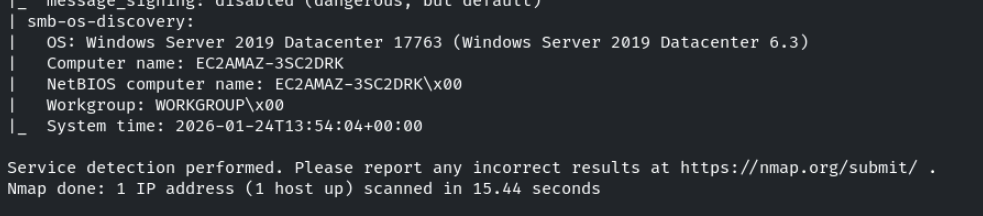

Since smb open is open , lets use smb_login module in msf to find the username and password 

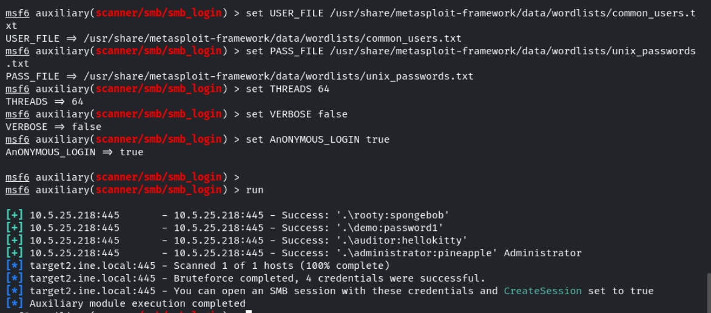

we found the username and password to create a session with it 

set SMBUser and SMBPass we found and set Createsession to true 
and then run the module 

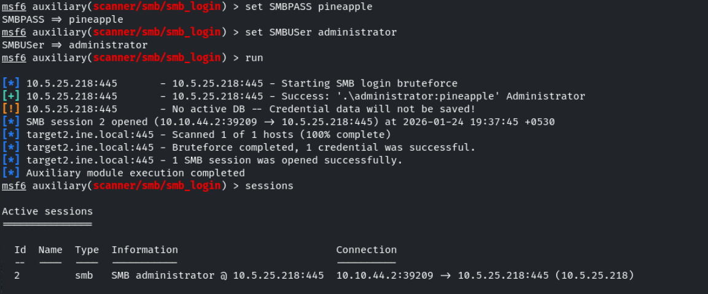

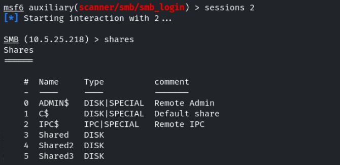

no juicy information is found on share 0 , lets interact with 1

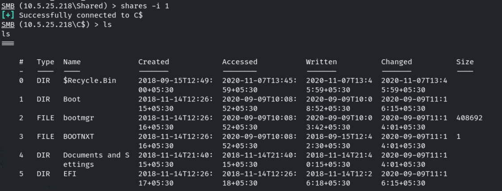
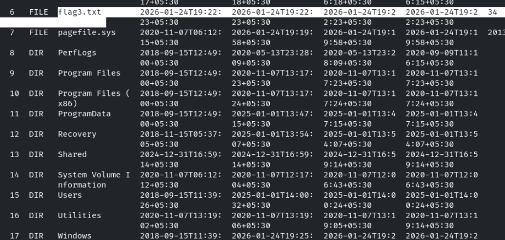

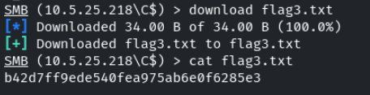

We have successfully found the flag3 , lets visit the Desktop folder to find the flag4

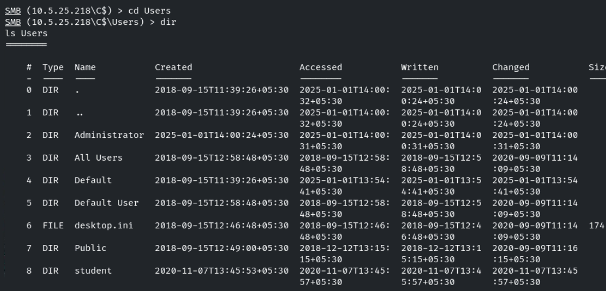

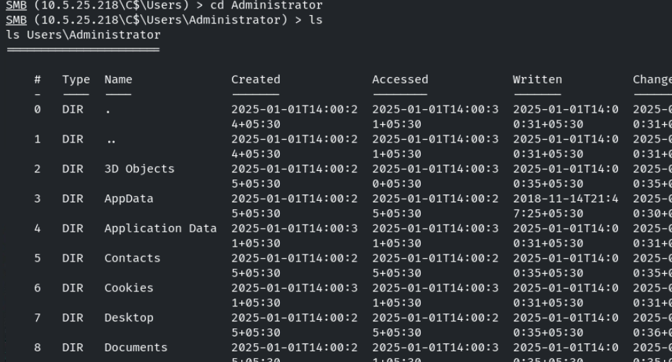

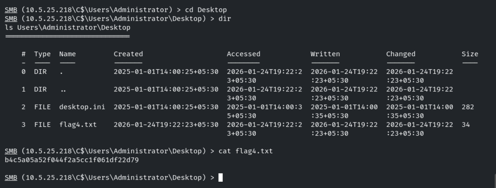

In Administrator folder under Desktop we found the flag4 

------------------------------------------------------------------THE END------------------------------------------------------------------

