In this lab environment, you will be provided with GUI access to a Kali Linux machine. Two machines are accessible at http://target1.ine.local and http://target2.ine.local.

Objective: Perform system/host-based attacks on the target and capture all the flags hidden within the environment.

Flags to Capture:

Flag 1: Check the root ('/') directory for a file that might hold the key to the first flag on target1.ine.local.

Flag 2: In the server's root directory, there might be something hidden. Explore '/opt/apache/htdocs/' carefully to find the next flag on target1.ine.local.

Flag 3: Investigate the user's home directory and consider using 'libssh_auth_bypass' to uncover the flag on target2.ine.local.

Flag 4: The most restricted areas often hold the most valuable secrets. Look into the '/root' directory to find the hidden flag on target2.ine.local.

## Lets start with an Nmap Scan on target1.ine.local

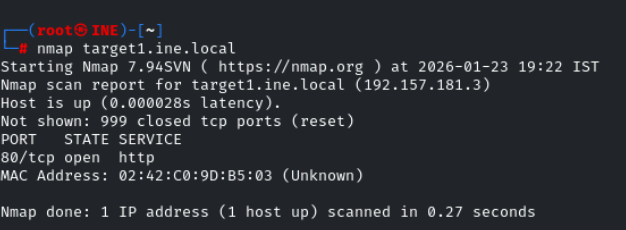 

lets perform service detection scan and default script scan on port 80

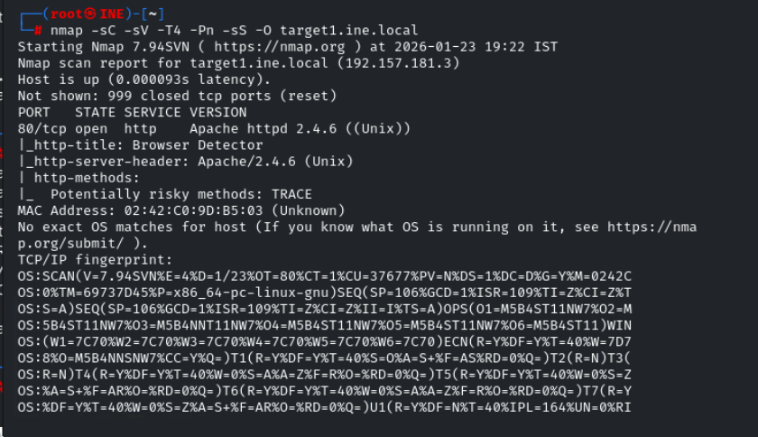

lets visit the site 

We can notice that it runs a cgi runs 

CGI = Common Gateway Interface

CGI is a standard interface that allows a web server (like Apache) to run external programs or scripts and send their output back to a web browser.

Shellshock is a vulnerability in Bash where Bash executes commands hidden inside environment variables.

lets use msf check whethere the cgi is vulnerable or not

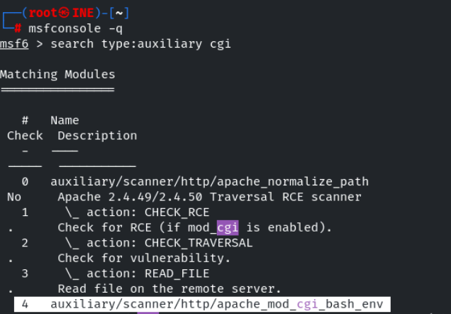

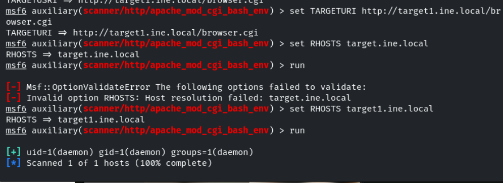

seems it is vulnerable so lets exploit it 

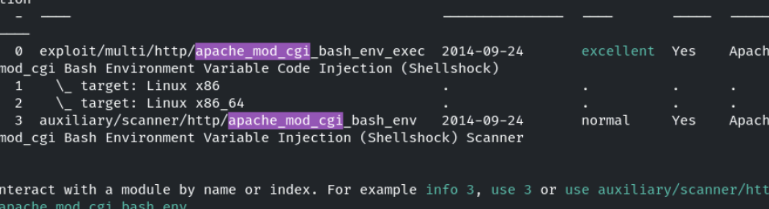

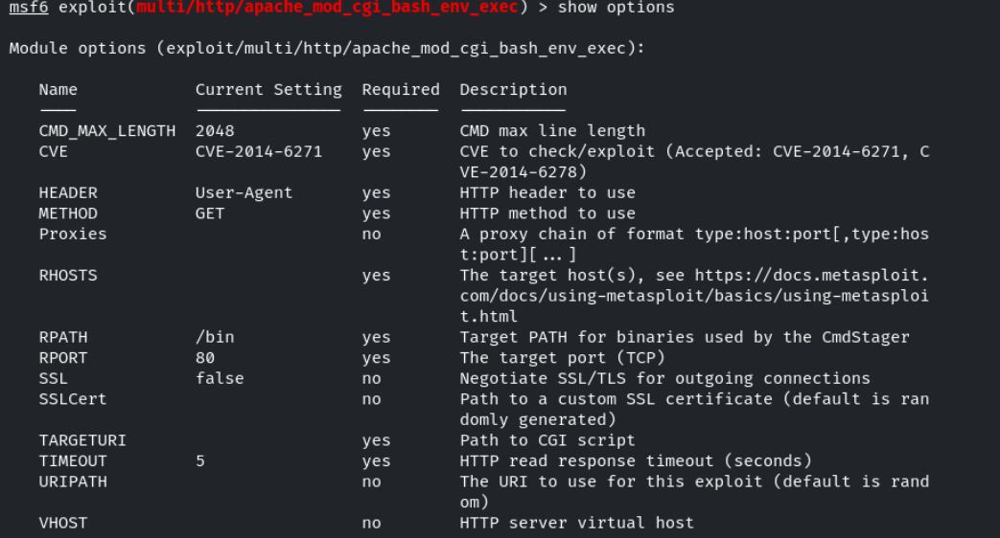

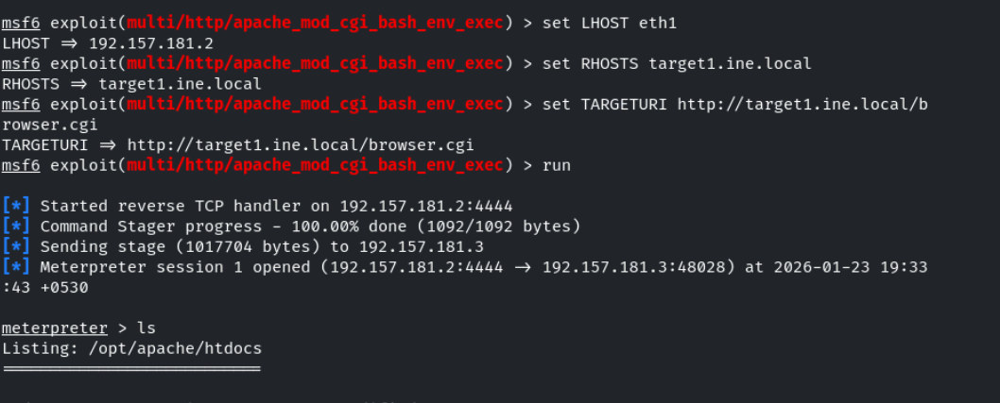

we successfully got the meterpreter session 

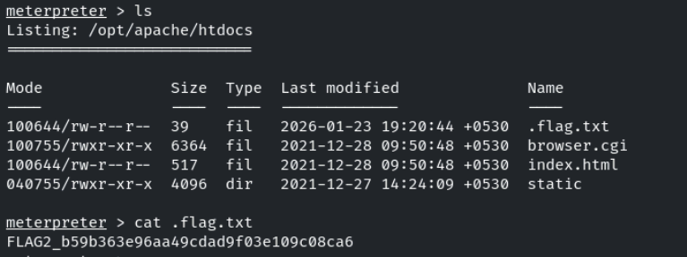

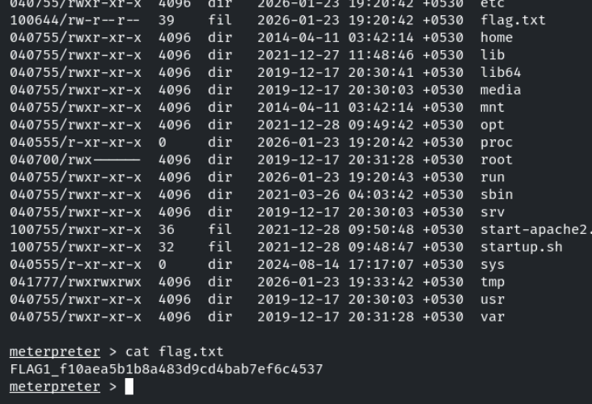

We suceessfully found the flag1 and flag2 

## Lets start with an Nmap scan on target2.ine.local

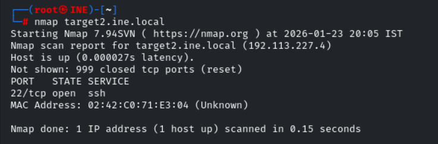

only ssh is open , lets perform service verison detection and default scan on it 

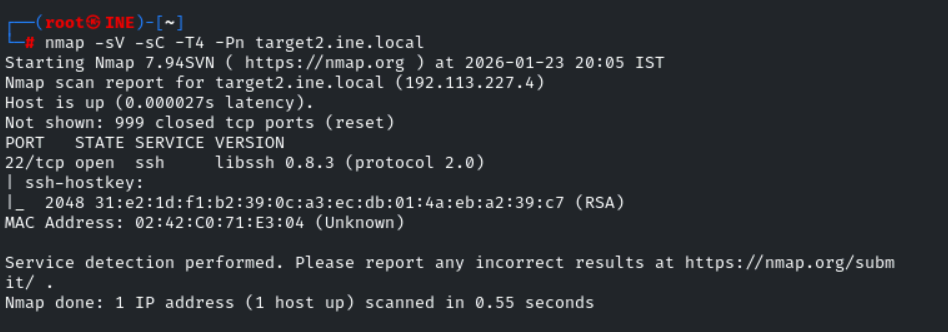

we found a ssh service , lets use msf to search for the module 

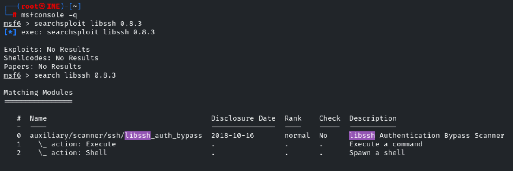

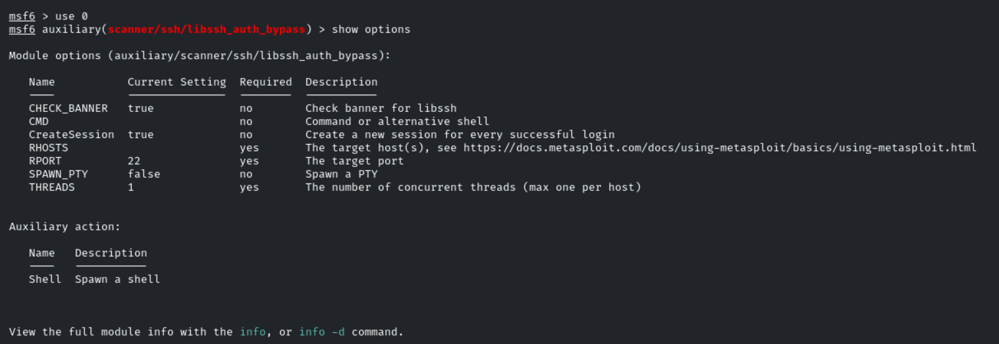

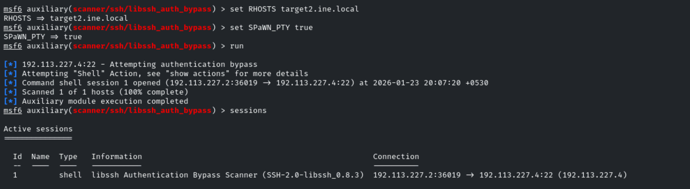

we got a session created , lets interact with it 

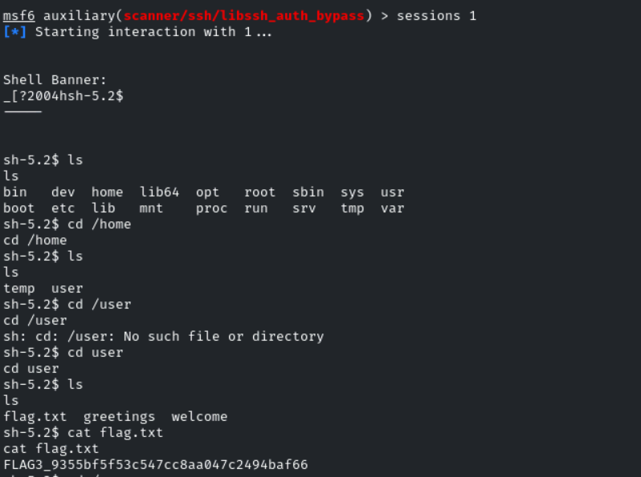

now lets escalate our privilage to read the flag4 ,

searching fot suid files where /user/welcome sounds intersting 

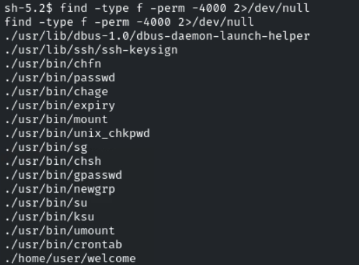

lets analyze it 

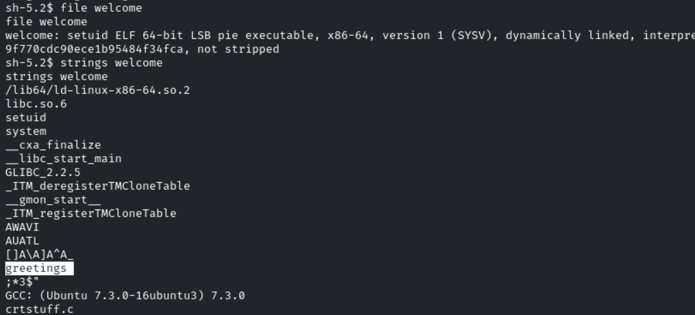

seems like welcome is executes the file greetings when it is run 

so lets remove the greetings like , since we cant able to edit or modify it and create a new greetings file with /bin/bash file contents 

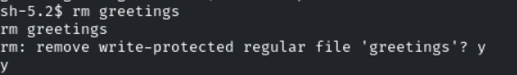

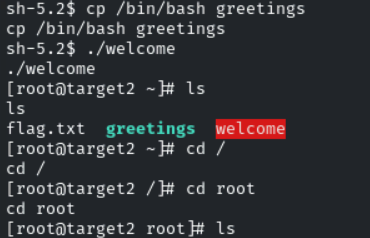

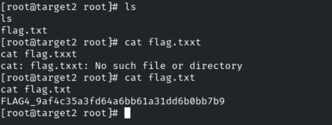

We have successfully found the flag3 and flag4 

--------------------------------------------------------------------------------------------

