Lab Environment
In this lab environment, you will have GUI access to a Kali machine. The target machine will be accessible at target.ine.local.

Objective: Use Metasploit and manual investigation techniques to capture the following flags:

Flag 1: Gain access to the MSSQLSERVER account on the target machine to retrieve the first flag.

Flag 2: Locate the second flag within the Windows configuration folder.

Flag 3: The third flag is also hidden within the system directory. Find it to uncover a hint for accessing the final flag.

Flag 4: Investigate the Administrator directory to find the fourth flag.

## Lets start with an Nmap Scan on target.ine.local

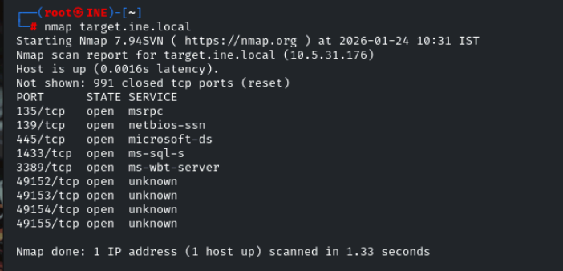

lets perform service version detection and default script scan on the open ports found

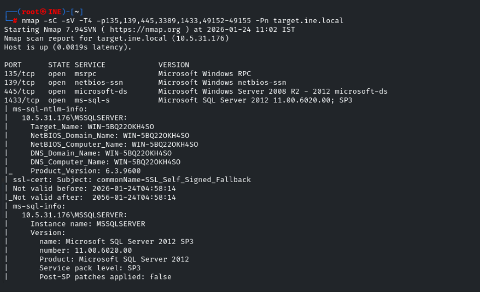
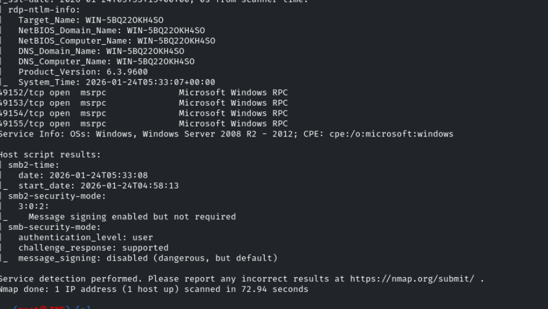

we found the version of mssql server running  , lets use msf to search for the corressponding module 

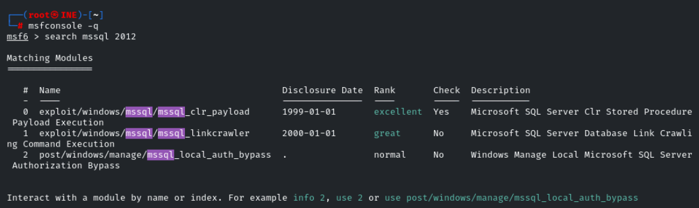

lets try the first exploit module 

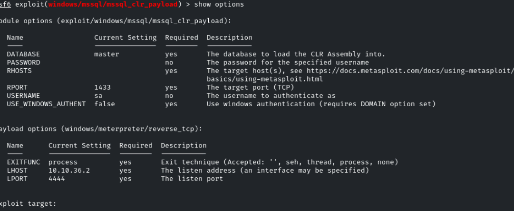

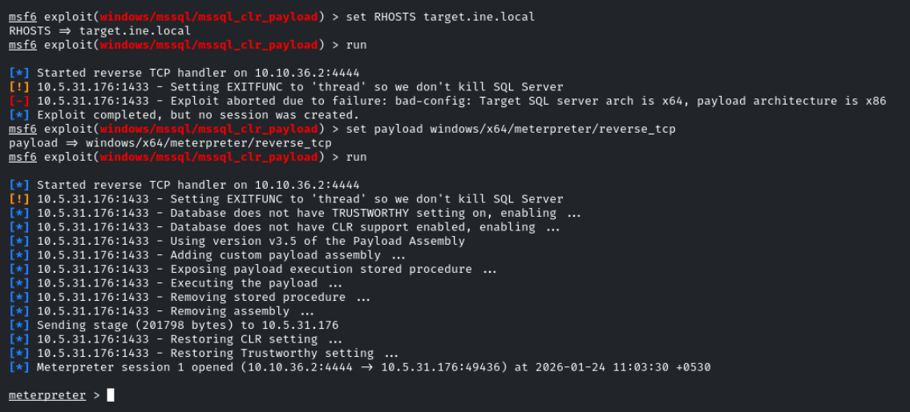 

We successfully got the meterpreter shell 

Lets check the root directory

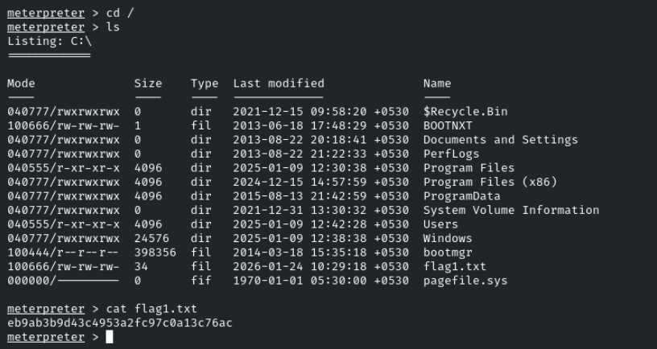

Lets visit windows system configuration folder

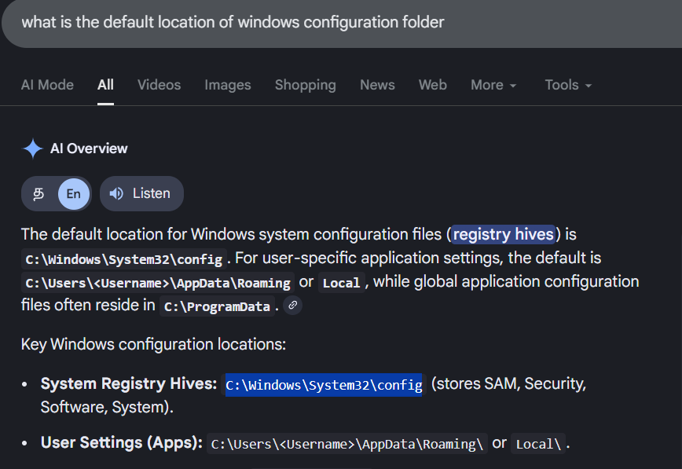 

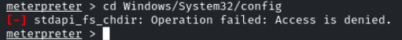

our permission is denied , so try escalate our privilage 

command : getprivs --> to list the ways to escalte the privilage 

getsystem --> use those methods and get us the prvileged session

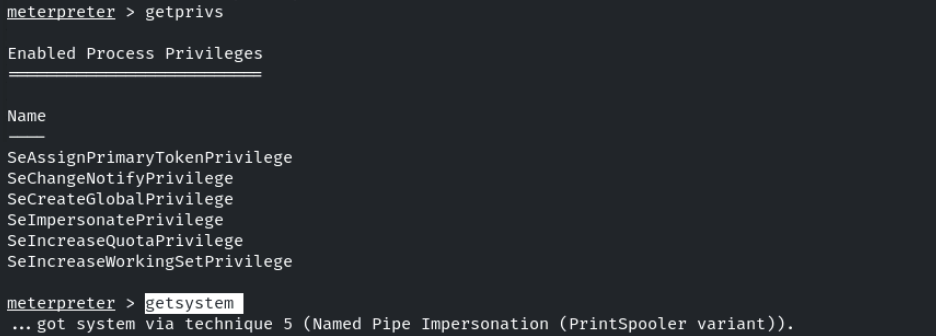

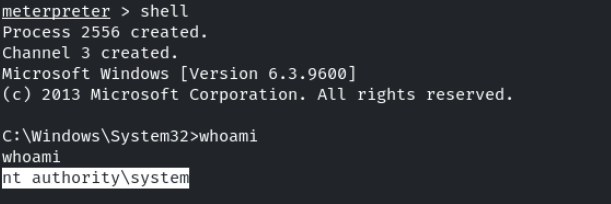

Now we got the highest privilage in the system now lets config folder

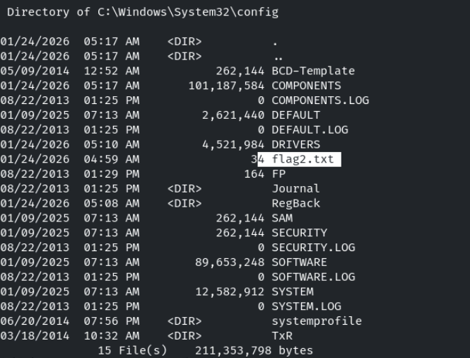

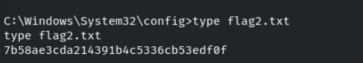

Now lets search for flag3 with the system32 folder 

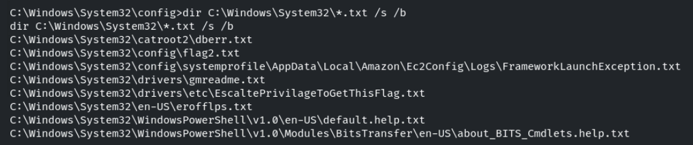

/s --> for search inside the sub folders

/b --> dont print detailed information , show only file path 

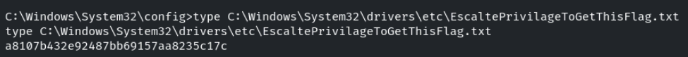

lets visit adminstrator user folder to find the fourth flag 

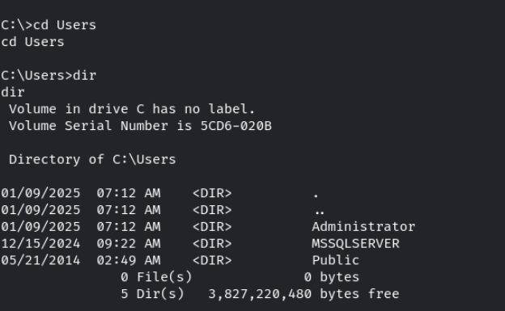

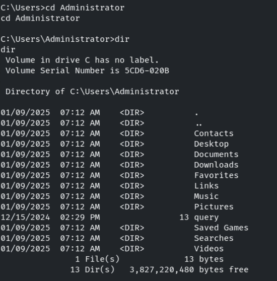

Lets check the Desktop folder 

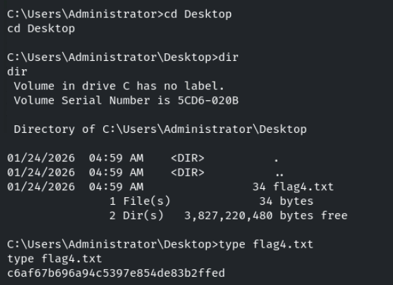

We successfully found all the four flags

-------------------------------------------------THE END----------------------------------------------

