Lab Environment

In this lab environment, you will be provided with GUI access to a Kali Linux machine. The target website is accessible at http://target.ine.local.

Objective: Identify web application vulnerabilities in the target website and capture all the flags hidden within the environment.

Useful wordlists:

/usr/share/wordlists/dirb/common.txt 

/usr/share/seclists/Usernames/top-usernames-shortlist.txt 

/root/Desktop/wordlists/100-common-passwords.txt

Flags to Capture:

Flag 1: Sometimes, important files are hidden in plain sight. Check the root ('/') directory for a file named 'flag.txt' that might hold the key to the first flag.

Flag 2: Explore the structure of the server's directories. Enumeration might reveal hidden treasures.

Flag 3: The login form seems a bit weak. Trying out different combinations might just reveal the next flag.

Flag 4: The login form behaves oddly with unexpected inputs. Think of injection techniques to access the 'admin' account and find the flag.

## Lets start With an Nmap scan on target.ine.local

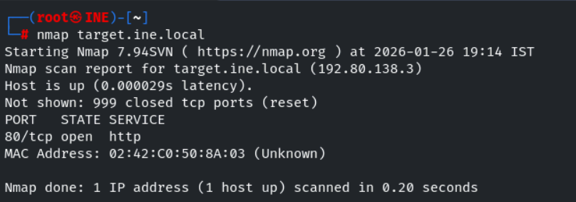

only port http is open , lets perform service version detection and default script scan and use http-enum on it to enemurate more information

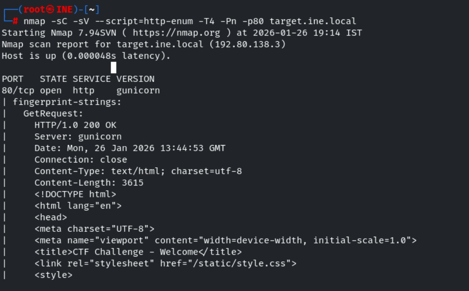
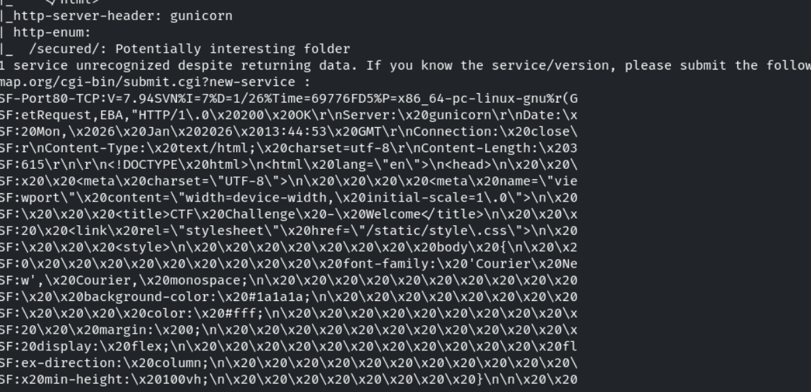

Lets visit the site 

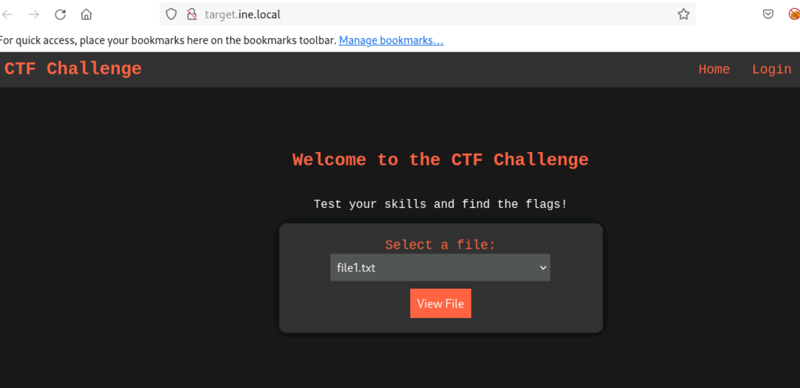

click on view file and notice the url 

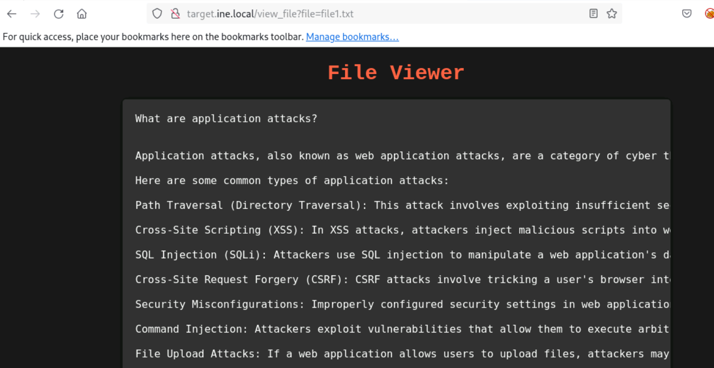

semms like it is vulnerable to local file inclusion , so lets view the flag.txt file 

file=../../../../../../../../flag.txt

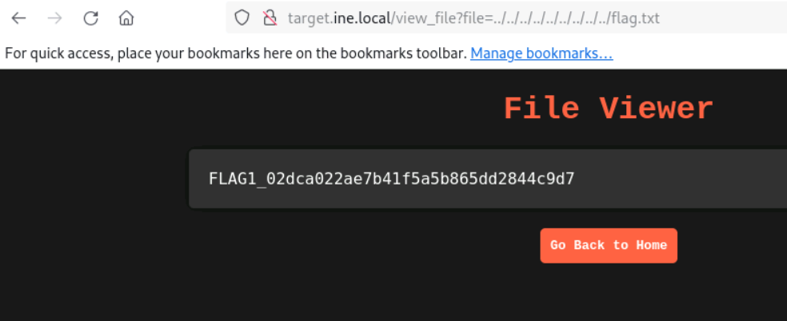

We successfully found the flag1 

lets use gobuster to enemurate the web directories 

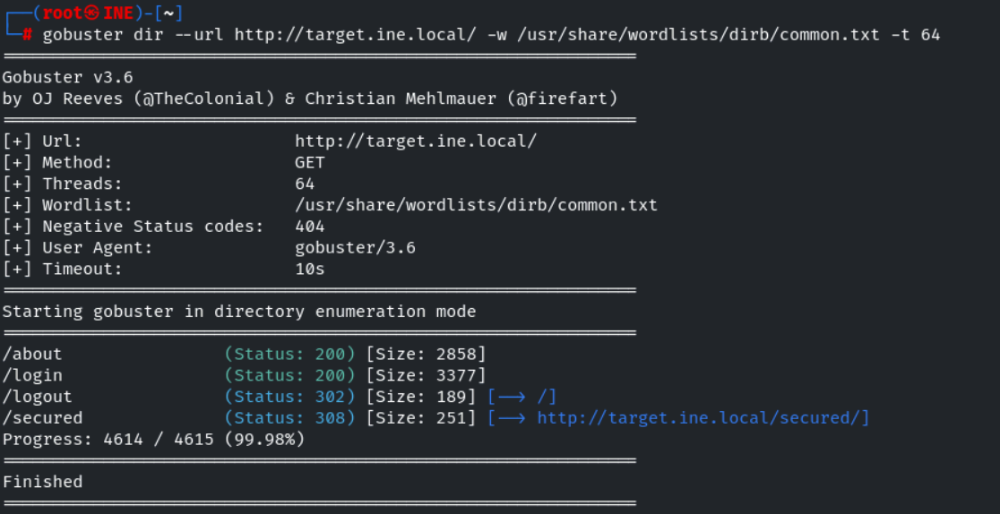

lets visit /secured

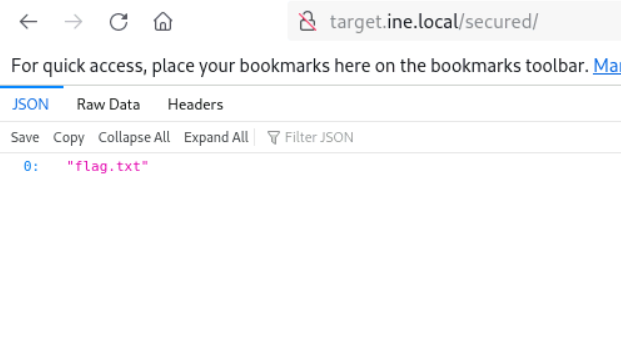

lets access the flag.txt

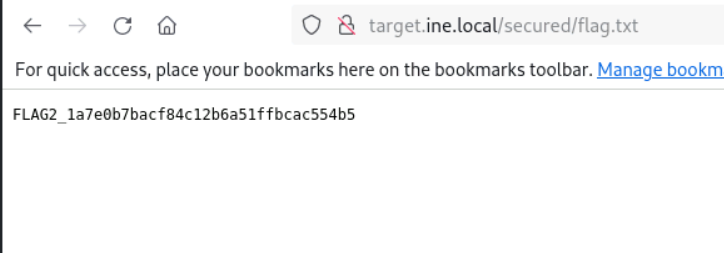

We successfully found the flag2 

Lets visit the /login 

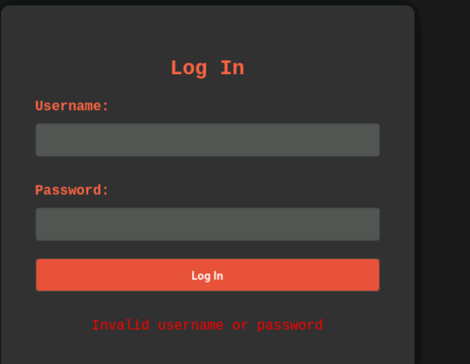

we are getting Invlaid username or password when entering wrong username or password --> this is useful in hydra while eliminating wrong username and password

lets analyze the post request in burp 

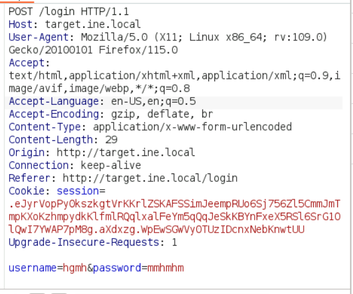

the username variable consits of the username we entered similary password variable consits of the password we entered

now lets use hydra to crack the username and password

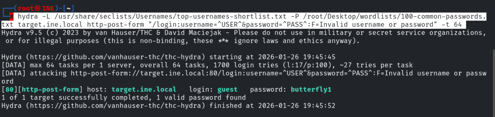

lets login with the username and password we found 

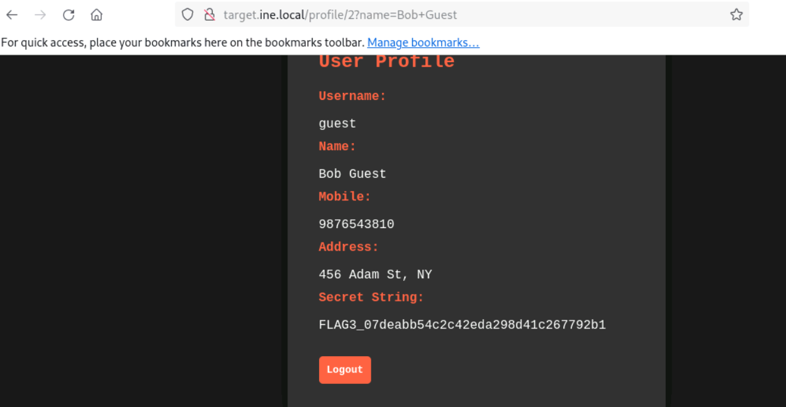

We successfully found the flag3

Flag 4: The login form behaves oddly with unexpected inputs. Think of injection techniques to access the 'admin' account and find the flag.

lets try sql injection 

in username type : admin'--

in password type : anything 

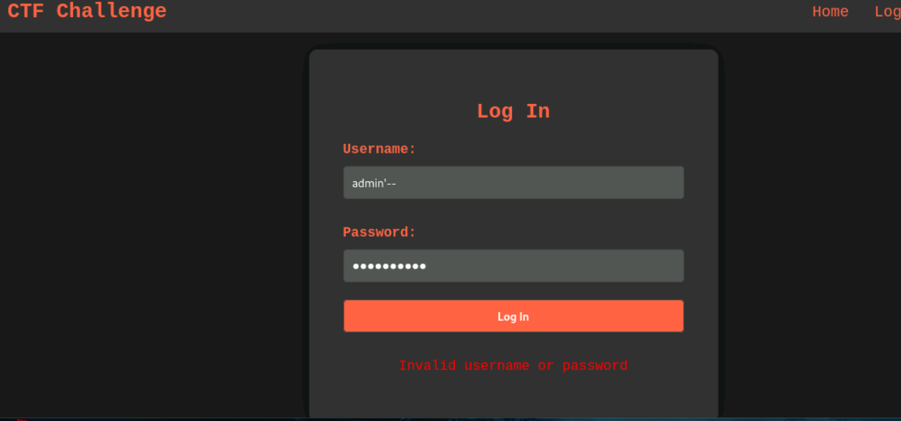

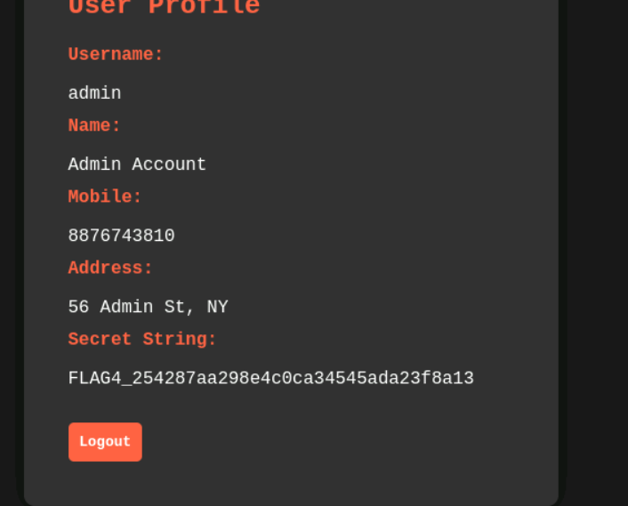

We successfully found the flag4 

---------------------------------------------------THE END------------------------------------------------------------------------------------
